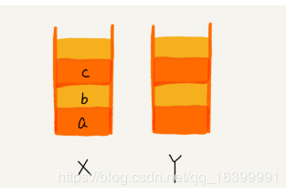
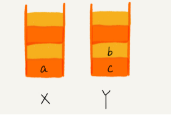
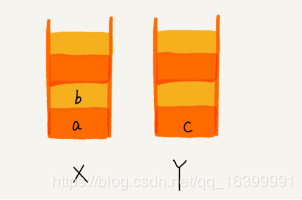
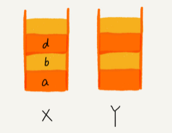

# 栈实践：实现浏览器前进后退
* **参考链接:**[算法系列- 栈：如何实现浏览器的前进和后退功能？](https://blog.csdn.net/qq_16399991/article/details/84261849)
### 1、思路
**我们使用两个栈，X 和 Y，我们把首次浏览的页面依次压入栈 X，当点击后退按钮时，再依
次从栈 X 中出栈，并将出栈的数据依次放入栈 Y。当我们点击前进按钮时，我们依次从栈 Y
中取出数据，放入栈 X 中。当栈 X 中没有数据时，那就说明没有页面可以继续后退浏览了。当
栈 Y中没有数据，那就说明没有页面可以点击前进按钮浏览了。**

比如你顺序查看了 a，b，c 三个页面，我们就依次把 a，b，c 压入栈，
这个时候，两个栈的数据就是这个样子：

当你通过浏览器的后退按钮，从页面 c 后退到页面 a 之后，我们就依次把c 和 b 从栈 X 中弹出
，并且依次放入到栈 Y。这个时候，两个栈的数据就是这个样子：

这个时候你又想看页面 b，于是你又点击前进按钮回到 b 页面，我们就把 b 再从栈 Y 中出栈，放
入栈 X 中。此时两个栈的数据是这个样子：

这个时候，你通过页面 b 又跳转到新的页面 d 了，页面 c 就无法再通过前进、后退按钮重复查看
了，所以需要清空栈 Y。此时两个栈的数据这个样子：

