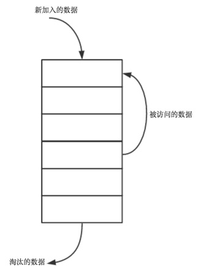

## 哈希表常常识

### 1、桶和起始桶

**散列（哈希）:** 用一个散列函数把字典的数对映射到散列表的具体位置

**桶：** 散列的每一个位置

**起始桶：** 关键字为k的数对在散列中的位置f(k)

### 2、除法散列函数

形式：**f(k)=k%D**

(k为关键字，D为散列的长度（桶的数量）)

**注意：**
* **理想的D是一个素数，当你不能找到接近散列长度的素数时，应该旋转2和19
之间的D**

* **选择除数D为奇，可以使关键字依赖所有位**

* **当D既是素数又不能被小于20的数整除，就能得到好的散列**

### 3、冲突和溢出

**冲突：** 当两个关键字对应的起始桶相同

**溢出：** 如果存储桶没有足够的空间存储新的数对

**注意：**

线性探查:通过找到下一个可用桶来解决冲突问题

### 4、线性探查

## 编程实践1：LRU缓存淘汰算法

### 1、原理
LRU（Least recently used，最近最少使用）缓存算法根据数据最近被访问的情况来进行淘汰数据，其核心思想是“如果数据最近被访问过，那么将来被访问
的几率也更高”。

### 2、实现
1. 当缓存空间未满时，数据一直往新的空间写； 
2. 当缓存满，并且缓存中没有需要访问的数据时，最先进入缓存的数据被淘汰掉； 
3. 当缓存满，并且缓存中有需要访问的数据时，做了一个数据交换，把访问的数据拿出来，其余数据往下压，最后把访问的数据放到顶部 

**【参考链接】**
* [LRU缓存淘汰算法分析与实现](https://blog.csdn.net/qq1332479771/article/details/69370779)
* [常见缓存算法和LRU的c++实现](https://www.cnblogs.com/cpselvis/p/6272096.html)
* [使用散列表和链表实现LRU缓存淘汰算法](https://blog.csdn.net/liushengxi_root/article/details/86500200)
