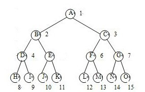
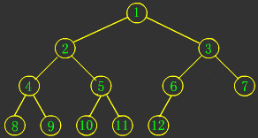
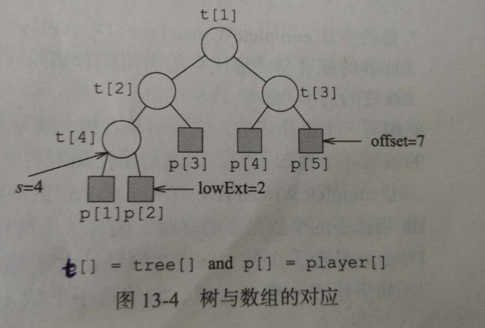
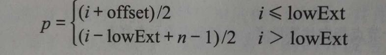
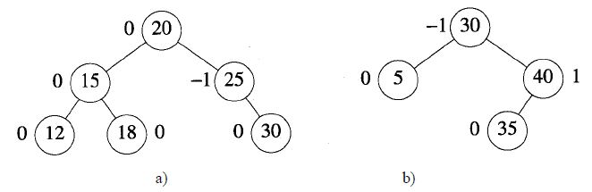
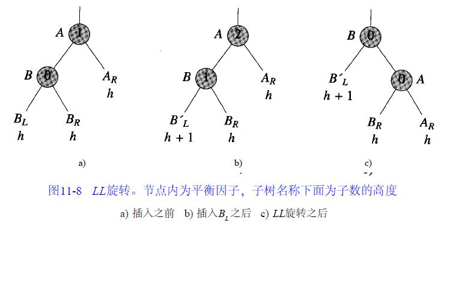
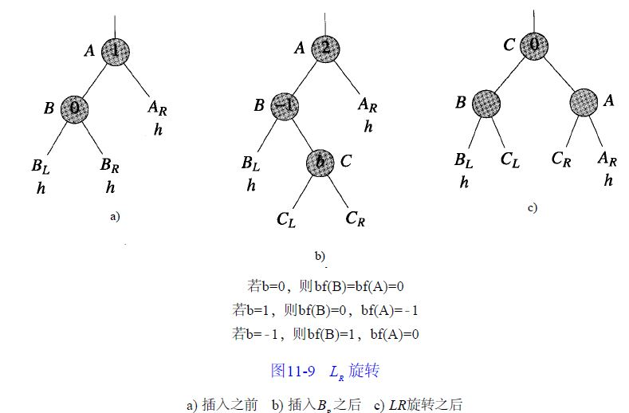

## 1、二叉树

### 1.1、二叉树的特性
* **一颗二叉树有n个元素（n>0），它有n-1条边**
* **一棵二叉树高度为h(h>=0),它至少有h个元素，最多有2^h-1个元素**
* **一颗二叉树有n个元素(n>0),它的高度为n，最小高度为[log2(n+1)]**
* **完全二叉树的一元素编号为i(1<=i<=n)，有以下关系成立**

1. 如果i=1，该元素为二叉树的根。若i>1,则其父节点的编号为i/2;
2. 如果2i>n，则表示该元素无左孩子。否则，其左孩子的编号为2i;
3. 如果2i+1>n，则其元素无右孩子。否则其右孩子的编号为2i+1。

### 1.2、常见二叉树的分类

**1. 二叉树**

二叉树是每个节点最多有两个子树的树结构。

**2. 满二叉树**

一棵深度为k，且有2^k-1个节点的树是满二叉树。

**性质：**

1.如果一颗树深度为h，最大层数为k，且深度与最大层数相同，即k=h;

2.它的叶子数是： 2^(h-1)

3.第k层的结点数是： 2^(k-1)

4.总结点数是： 2^k-1 (2的k次方减一)

5.总节点数一定是奇数。

6.树高：h=log2(n+1)。

**3. 完全二叉树**

若设二叉树的深度为h，除第 h 层外，其它各层 (1～h-1) 的结点数都达到最大个数，第h 层所有
的结点都连续集中在最左边，这就是完全二叉树。

**性质：**

1.深度为k的完全二叉树，至少有2^(k-1)个节点，至多有2^k-1个节点。

2.树高h=log2n + 1。

## 2、竞赛树

### 2.1、赢者树

我们使用完全二叉树的数组表示赢者树。一颗赢者树有n名选手，需要n-1个内部节点 tree[1:n-1]。选手或者外部节点用数组 player[1:n] 表示，因此 
tree[i] 是数组player的一个索引，类型为int。在赢者树的节点 i 对应比赛中的赢者 tree[i] 。图13-4给出在5个选手的赢者树中，各节点与数组 tree 
和 player 之间的对应关系

为实现这种对应关系，我们必须能够确定外部节点 player[i]  的父节点 tree[p]。当外部节点的个数为n时，内部节点的个数为n-1。最低层最左端的内部节
点，其编号为s，并且有s=2^log（n-1）。因此，最底层内部节点的个数为n-s，而最底层外部节点的个数lowExt是这个数的2倍。例如，在图13-4中，n=5，
s=4，最底层最左端的内部节点是 tree[4]，这一层的内部节点个数为n-4=1个。最底层外部节点个数lowExt=2，倒数第二层最左端的外部节点编号
是lowExt+1.。令offset=2*s-1。对于任何一个外部节点player[i] ，其父节点tree[p]有一下公式给出：

赢者树关键的两个操作是初始化和重新组织比赛。为了初始化一个赢者树，我们从右孩纸选手开始，进行他所参加的比赛，而且逐层网上，只要是从右孩纸上升到
比赛节点，就可以进行在该节点的比赛。为此，要从左往右的考察右孩纸选手。在图13-4的树种，我们首先进行选手 player[2] 的比赛，然后进行player[3]
的比赛，最后进行 player[5]的比赛。首先，我们进行选手 player[2] 参加在节点 tree[4]  的比赛，但是接下来，我们不能在上一层节点tree[2]的
比赛，因为tree[4]是左孩纸。然后我们进行选手 player[3] 参加在tree[2] 的比赛，但是接下来不能进行在节点tree[1]的比赛，因为tree[2]是左孩纸。
最后我们进行选手 play[5] 参加的在节点tree[3]的比赛和在节点 tree[1] 的比赛。注意，节点 tree[i] 节点记录的是比赛的赢者。

当选手 thePlayer 的值改变，在从外部节点 player[ thePlayer ] 到根节点 tree[1] 的路径上，一部分或者全部比赛都需要进行重赛。

> **参考链接：** 

[数据结构学习笔记（七）竞赛树](https://blog.csdn.net/baidu_35573762/article/details/52073283)

### 2.2、输者树

## 3、搜索树

**二叉搜索树：** 二叉搜索树是以一棵二叉树来组织，每个节点就是一个对象，包括key、卫星数
据，除此之外还包括一些为了维持树结构所需要的信息：left、right、parent，分别指向左孩
子、右孩子、父节点。其中如果孩子节点或者父节点不存在时，用NULL表示。根节点是树中唯一一个
父节点为NULL的节点。

**性质：**

1、每个元素都有一个关键字，并且任意两个元素的关键字都不同；因此，所有关键字都是唯一的；

2、如果节点的左子树不空，则左子树上所有结点的值均小于等于它的根结点的值；

3、如果节点的右子树不空，则右子树上所有结点的值均大于等于它的根结点的值；

4、任意节点的左、右子树也分别为二叉查找树；

**操作**

*1、插入*

确定该搜索数中是否存在该元素，如果存在直接替换；如果不存在，将该元素插入最终搜索点的左、右
孩子节点中。

*2、删除*

1）**如果删除点为叶子节点** ,直接释放叶子节点；如果该节点为根，则令根为NULL;

2）**如果删除的节点只有一颗非空的子树** ,如果p没有父节点（p为根节点），则p的唯一子树的
根节点成为搜索树的根节点；如果p有父节点pp，则修改pp的指针域，使其指向p唯一的孩子，并释放p;

3）**如果删除的节点p具有两颗非空的子树** ,将该节点元素替换为**左子树的最大元素**或
**右子树的最小元素**，然后将该节点删除。

**注意：** 如何查找左子树的最小值或右子树的最大值？

* 左子树的最大值：沿着右子树的左孩子指针移动，直到指针为NULL。
* 右子树的最小值：沿着左子树的右孩子指针移动，直到指针为NULL。

### 3.1、索引二叉搜索树

**索引二叉搜索树:** 在普通的搜索二叉树的每一个节点中添加一个leftSize域，这个域的值是
该节点左子树元素的个数

> **参考链接：**

[二叉搜索树详解](https://www.jianshu.com/p/227c1b0cac8c)

[带索引的二叉搜索树](https://wenku.baidu.com/view/dcf337a1f8c75fbfc67db23a.html)

## 4、平衡搜索树

各种字典结构的渐近时间性能：
<table>
    <tr>
        <th rowspan="2">方法</th>
        <th colspan="3">最坏情况</th>
        <th colspan="3">平均情况</th>
    </tr>
    <tr>
        <td>搜索</td>
        <td>插入</td>
        <td>删除</td>
        <td>搜索</td>
        <td>插入</td>
        <td>删除</td>
    </tr>
    <tr>
        <td>有序数组</td>
        <td>logn</td>
        <td>n</td>
        <td>n</td>
        <td>logn</td>
        <td>n</td>
        <td>n</td>
    </tr>
    <tr>
        <td>有序链表</td>
        <td>n</td>
        <td>n</td>
        <td>n</td>
        <td>n</td>
        <td>n</td>
        <td>n</td>
    </tr>
    <tr>
        <td>跳表</td>
        <td>n</td>
        <td>n</td>
        <td>n</td>
        <td>logn</td>
        <td>logn</td>
        <td>logn</td>
    </tr>
    <tr>
        <td>哈希表</td>
        <td>n</td>
        <td>n</td>
        <td>n</td>
        <td>1</td>
        <td>1</td>
        <td>1</td>
    </tr>
    <tr>
        <td>二叉搜索树</td>
        <td>n</td>
        <td>n</td>
        <td>n</td>
        <td>logn</td>
        <td>logn</td>
        <td>logn</td>
    </tr>
    <tr>
        <td>AVL树</td>
        <td>logn</td>
        <td>logn</td>
        <td>logn</td>
        <td>logn</td>
        <td>logn</td>
        <td>logn</td>
    </tr>
    <tr>
        <td>红黑树</td>
        <td>logn</td>
        <td>logn</td>
        <td>logn</td>
        <td>logn</td>
        <td>logn</td>
        <td>logn</td>
    </tr>
    <tr>
        <td>分裂树</td>
        <td>n</td>
        <td>n</td>
        <td>n</td>
        <td>logn</td>
        <td>logn</td>
        <td>logn</td>
    </tr>
    <tr>
        <td>B-树</td>
        <td>logn</td>
        <td>logn</td>
        <td>logn</td>
        <td>logn</td>
        <td>logn</td>
        <td>logn</td>
    </tr>
</table>

AVL和红-黑树适用于内部存储的运用，B-树适用于外部存储的应用。

在实际运用中，当我们需要实施的操作为按关键字查找、插入和删除操作，这时散列的性能超过平衡
搜索树，此时，优先选择散列。如果关键字按照字典操作，且时间不能超过指定的范围，此时提倡使用
平衡搜索树。对于那些按名次实施查找删除的操作，以及那些不按精确关键字匹配的进行字典操作
（如寻找关键字大于k的最小元素），建议使用平衡搜索树。

对于较小可以在内存中处理的字典，AVL和红-黑树都能提供很好的性能；对于大型字典，必须存储于
磁盘中时则需要度数更大，高度更低的树，如：B-树。

**平衡树:** 最坏的情况下高度为O(logn)的树

### 4.1、AVL树

**AVL树:** 空二叉树是AVL树；如果T是一棵非空的二叉树，TL和TR分别是其左子树和右子树，那
么当T满足以下条件时，T是一棵AV L树：1) TL 和TR 是AV L树；2)|hL-hR|≤1, hL和hR分别是左子
树和右子树的高度。

**特征：**

（1）n个元素得AVL树的高度是O(logn)

（2）对于每一个n（n≥0）值，都存在一棵AV L树.（否则，在插入完成后，一棵AVL树将不再是AVL树，
因为对当前元素数来说不存在对应的AVL树）

（3）一棵n元素的AVL搜索树能在O(高度) = O(logn)的时间内完成搜索。

（4）将一个新元素插入到一棵n元素的AV L搜索树中，可得到一棵n+1元素的AVL树，这种插入过程可
以在O(logn)时间内完成。

（5）从一棵n元素的AVL搜索树中删除一个元素，可得到一棵n-1元素的AVL树，这种删除过程可以在
O(logn)时间内完成。

1、**AVL树的高度：** log(n)

2、**AVL描述：** 平衡因子bf(x)=x的左子树的高度-x的右子树的高度

从AVL树的定义可以知道，平衡因子的可能取值为-1，0和1。下图给出了两棵AV L搜索树和树中每
个节点的平衡因子。

3、**AVL搜索树的搜索：** 同二叉搜索树

4、**AVL搜索树的插入：** 将一个新元素插入到AVL树中时，若得到的新树中有一个或多个节点
的平衡因子的值不是-1，0或1，那么就说新树是不平衡的。可以通过移动不平衡树的子树来恢复树的
平衡。

细分不平衡类型的方法，节点的不平衡类型将是LL（新插入节点在节点的左子树的左子树中），
LR（新插入节点在A节点的左子树的右子树中），RR和RL四种类型中的一种。

* LL型不平衡

图11-8a 给出了插入前的条件，图11-8b 是在节点B的左子树B' 中插入一个元素后的情形，而恢复平
衡所进行的子树移动如图11-8c 所示。原来以A为根节点的子树，现在以B 为根节点，B'L 仍然是B 
的左子树，A变成B的右子树，BR变成A的左子树，A的右子树不变。由于A的平衡因子改变了，所以处于
从B 到新插入节点途中的B'的所有节点的平衡因子都将改变，其他节点的平衡因子与旋转前保持一致。
图11 - 8中a和c子树的高度是一样的，所以，子树的祖父节点的平衡因子与插入前是一样的。因此不再
有平衡因子不是-1，0或1的节点。一个LL旋转就已经使整个树重新获得平衡！可以验证重新平衡后的
树确实是一棵二叉搜索树。

* LR 型不平衡

** AVL搜索树的插入算法：**

(1) 沿着从根节点开始的路径对具有相同关键值的元素进行搜索，以找到插入新元素的位置。在
此过程中，寻找最近的，平衡因子为- 1或1的节点，令其为A 节点。如果找到了相同关键值
的元素，那么插入失败，以下步骤无需执行。

(2) 如果没有这样的节点A，那么从根节点开始再遍历一次，并修改平衡因子，然后终止。

(3) 如果b f(A) = 1并且新节点插入到A的的右子树中，或者b f(A) =-1并且插入是在左子树中进行的，
那么A 的新平衡因子是0。这种情况下，修改从A 到新节点途中的平衡因子，然后终止。

(4) 确定A 的不平衡类型并执行相应的旋转，在从新子树根节点至新插入节点途中，根据旋转需
要修改相应的平衡因子。

5、**AVL搜索树的删除：** 见代码实现

> **参考链接：**

[AVL树的插入与删除](https://blog.csdn.net/liuyu5210/article/details/77586729)

[平衡二叉搜索树（AVL）详解](https://blog.csdn.net/tanrui519521/article/details/80935348)

[AVL树(一)之 图文解析 和 C语言的实现 ](https://www.cnblogs.com/skywang12345/p/3576969.html)

### 4.2、红-黑树

> **参考链接：**

[二叉搜索树详解](https://www.jianshu.com/p/227c1b0cac8c)

### 4.3、分裂树

> **参考链接：**

[二叉搜索树详解](https://www.jianshu.com/p/227c1b0cac8c)

### 4.4、B-树

> **参考链接：**

[二叉搜索树详解](https://www.jianshu.com/p/227c1b0cac8c)

## 5、优先级队列
元素出队列的顺序由元素的优先级来确定

### 5.1、堆实现优先级队列
**大（小）根堆：** 每个节点都大于（小于）或等于其子节点的值。

