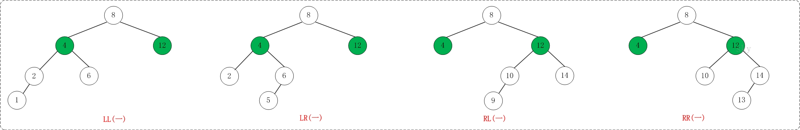
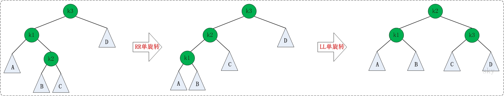
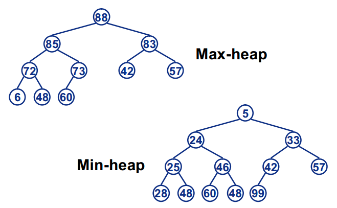

## 1、二叉树

### 1.1、二叉树的特性
* **一颗二叉树有n个元素（n>0），它有n-1条边**
* **一棵二叉树高度为h(h>=0),它至少有h个元素，最多有2^h-1个元素**
* **一颗二叉树有n个元素(n>0),它的高度为n，最小高度为[log2(n+1)]**
* **完全二叉树的一元素编号为i(1<=i<=n)，有以下关系成立**

1. 如果i=1，该元素为二叉树的根。若i>1,则其父节点的编号为i/2;
2. 如果2i>n，则表示该元素无左孩子。否则，其左孩子的编号为2i;
3. 如果2i+1>n，则其元素无右孩子。否则其右孩子的编号为2i+1。

### 1.2、常见二叉树的分类

**1. 二叉树**

二叉树是每个节点最多有两个子树的树结构。

**2. 满二叉树**

一棵深度为k，且有2^k-1个节点的树是满二叉树。

**性质：**

1.如果一颗树深度为h，最大层数为k，且深度与最大层数相同，即k=h;

2.它的叶子数是： 2^(h-1)

3.第k层的结点数是： 2^(k-1)

4.总结点数是： 2^k-1 (2的k次方减一)

5.总节点数一定是奇数。

6.树高：h=log2(n+1)。

**3. 完全二叉树**

若设二叉树的深度为h，除第 h 层外，其它各层 (1～h-1) 的结点数都达到最大个数，第h 层所有
的结点都连续集中在最左边，这就是完全二叉树。

**性质：**

1.深度为k的完全二叉树，至少有2^(k-1)个节点，至多有2^k-1个节点。

2.树高h=log2n + 1。

## 2、竞赛树

### 2.1、赢者树

我们使用完全二叉树的数组表示赢者树。一颗赢者树有n名选手，需要n-1个内部节点 tree[1:n-1]。选手或者外部节点用数组 player[1:n] 表示，因此 
tree[i] 是数组player的一个索引，类型为int。在赢者树的节点 i 对应比赛中的赢者 tree[i] 。图13-4给出在5个选手的赢者树中，各节点与数组 tree 
和 player 之间的对应关系

为实现这种对应关系，我们必须能够确定外部节点 player[i]  的父节点 tree[p]。当外部节点的个数为n时，内部节点的个数为n-1。最低层最左端的内部节
点，其编号为s，并且有s=2^log（n-1）。因此，最底层内部节点的个数为n-s，而最底层外部节点的个数lowExt是这个数的2倍。例如，在图13-4中，n=5，
s=4，最底层最左端的内部节点是 tree[4]，这一层的内部节点个数为n-4=1个。最底层外部节点个数lowExt=2，倒数第二层最左端的外部节点编号
是lowExt+1.。令offset=2*s-1。对于任何一个外部节点player[i] ，其父节点tree[p]有一下公式给出：

赢者树关键的两个操作是初始化和重新组织比赛。为了初始化一个赢者树，我们从右孩纸选手开始，进行他所参加的比赛，而且逐层网上，只要是从右孩纸上升到
比赛节点，就可以进行在该节点的比赛。为此，要从左往右的考察右孩纸选手。在图13-4的树种，我们首先进行选手 player[2] 的比赛，然后进行player[3]
的比赛，最后进行 player[5]的比赛。首先，我们进行选手 player[2] 参加在节点 tree[4]  的比赛，但是接下来，我们不能在上一层节点tree[2]的
比赛，因为tree[4]是左孩纸。然后我们进行选手 player[3] 参加在tree[2] 的比赛，但是接下来不能进行在节点tree[1]的比赛，因为tree[2]是左孩纸。
最后我们进行选手 play[5] 参加的在节点tree[3]的比赛和在节点 tree[1] 的比赛。注意，节点 tree[i] 节点记录的是比赛的赢者。

当选手 thePlayer 的值改变，在从外部节点 player[ thePlayer ] 到根节点 tree[1] 的路径上，一部分或者全部比赛都需要进行重赛。

> **参考链接：** 

[数据结构学习笔记（七）竞赛树](https://blog.csdn.net/baidu_35573762/article/details/52073283)

### 2.2、输者树

## 3、搜索树

**二叉搜索树：** 二叉搜索树是以一棵二叉树来组织，每个节点就是一个对象，包括key、卫星数
据，除此之外还包括一些为了维持树结构所需要的信息：left、right、parent，分别指向左孩
子、右孩子、父节点。其中如果孩子节点或者父节点不存在时，用NULL表示。根节点是树中唯一一个
父节点为NULL的节点。

**性质：**

1、每个元素都有一个关键字，并且任意两个元素的关键字都不同；因此，所有关键字都是唯一的；

2、如果节点的左子树不空，则左子树上所有结点的值均小于等于它的根结点的值；

3、如果节点的右子树不空，则右子树上所有结点的值均大于等于它的根结点的值；

4、任意节点的左、右子树也分别为二叉查找树；

**操作**

*1、插入*

确定该搜索数中是否存在该元素，如果存在直接替换；如果不存在，将该元素插入最终搜索点的左、右
孩子节点中。

*2、删除*

1）**如果删除点为叶子节点** ,直接释放叶子节点；如果该节点为根，则令根为NULL;

2）**如果删除的节点只有一颗非空的子树** ,如果p没有父节点（p为根节点），则p的唯一子树的
根节点成为搜索树的根节点；如果p有父节点pp，则修改pp的指针域，使其指向p唯一的孩子，并释放p;

3）**如果删除的节点p具有两颗非空的子树** ,将该节点元素替换为**左子树的最大元素**或
**右子树的最小元素**，然后将该节点删除。

**注意：** 如何查找左子树的最小值或右子树的最大值？

* 左子树的最大值：沿着右子树的左孩子指针移动，直到指针为NULL。
* 右子树的最小值：沿着左子树的右孩子指针移动，直到指针为NULL。

### 3.1、索引二叉搜索树

**索引二叉搜索树:** 在普通的搜索二叉树的每一个节点中添加一个leftSize域，这个域的值是
该节点左子树元素的个数

> **参考链接：**

[二叉搜索树详解](https://www.jianshu.com/p/227c1b0cac8c)

[带索引的二叉搜索树](https://wenku.baidu.com/view/dcf337a1f8c75fbfc67db23a.html)

## 4、平衡搜索树

各种字典结构的渐近时间性能：
<table>
    <tr>
        <th rowspan="2">方法</th>
        <th colspan="3">最坏情况</th>
        <th colspan="3">平均情况</th>
    </tr>
    <tr>
        <td>搜索</td>
        <td>插入</td>
        <td>删除</td>
        <td>搜索</td>
        <td>插入</td>
        <td>删除</td>
    </tr>
    <tr>
        <td>有序数组</td>
        <td>logn</td>
        <td>n</td>
        <td>n</td>
        <td>logn</td>
        <td>n</td>
        <td>n</td>
    </tr>
    <tr>
        <td>有序链表</td>
        <td>n</td>
        <td>n</td>
        <td>n</td>
        <td>n</td>
        <td>n</td>
        <td>n</td>
    </tr>
    <tr>
        <td>跳表</td>
        <td>n</td>
        <td>n</td>
        <td>n</td>
        <td>logn</td>
        <td>logn</td>
        <td>logn</td>
    </tr>
    <tr>
        <td>哈希表</td>
        <td>n</td>
        <td>n</td>
        <td>n</td>
        <td>1</td>
        <td>1</td>
        <td>1</td>
    </tr>
    <tr>
        <td>二叉搜索树</td>
        <td>n</td>
        <td>n</td>
        <td>n</td>
        <td>logn</td>
        <td>logn</td>
        <td>logn</td>
    </tr>
    <tr>
        <td>AVL树</td>
        <td>logn</td>
        <td>logn</td>
        <td>logn</td>
        <td>logn</td>
        <td>logn</td>
        <td>logn</td>
    </tr>
    <tr>
        <td>红黑树</td>
        <td>logn</td>
        <td>logn</td>
        <td>logn</td>
        <td>logn</td>
        <td>logn</td>
        <td>logn</td>
    </tr>
    <tr>
        <td>分裂树</td>
        <td>n</td>
        <td>n</td>
        <td>n</td>
        <td>logn</td>
        <td>logn</td>
        <td>logn</td>
    </tr>
    <tr>
        <td>B-树</td>
        <td>logn</td>
        <td>logn</td>
        <td>logn</td>
        <td>logn</td>
        <td>logn</td>
        <td>logn</td>
    </tr>
</table>

AVL和红-黑树适用于内部存储的运用，B-树适用于外部存储的应用。

在实际运用中，当我们需要实施的操作为按关键字查找、插入和删除操作，这时散列的性能超过平衡
搜索树，此时，优先选择散列。如果关键字按照字典操作，且时间不能超过指定的范围，此时提倡使用
平衡搜索树。对于那些按名次实施查找删除的操作，以及那些不按精确关键字匹配的进行字典操作
（如寻找关键字大于k的最小元素），建议使用平衡搜索树。

对于较小可以在内存中处理的字典，AVL和红-黑树都能提供很好的性能；对于大型字典，必须存储于
磁盘中时则需要度数更大，高度更低的树，如：B-树。

**平衡树:** 最坏的情况下高度为O(logn)的树

### 4.1、AVL树

**AVL树:** 空二叉树是AVL树；如果T是一棵非空的二叉树，TL和TR分别是其左子树和右子树，那
么当T满足以下条件时，T是一棵AV L树：1) TL 和TR 是AV L树；2)|hL-hR|≤1, hL和hR分别是左子
树和右子树的高度。

**特征：**

（1）n个元素得AVL树的高度是O(logn)

（2）对于每一个n（n≥0）值，都存在一棵AV L树.（否则，在插入完成后，一棵AVL树将不再是AVL树，
因为对当前元素数来说不存在对应的AVL树）

（3）一棵n元素的AVL搜索树能在O(高度) = O(logn)的时间内完成搜索。

（4）将一个新元素插入到一棵n元素的AV L搜索树中，可得到一棵n+1元素的AVL树，这种插入过程可
以在O(logn)时间内完成。

（5）从一棵n元素的AVL搜索树中删除一个元素，可得到一棵n-1元素的AVL树，这种删除过程可以在
O(logn)时间内完成。

1、**AVL树的高度：** log(n)

2、**AVL描述：** 平衡因子bf(x)=x的左子树的高度-x的右子树的高度

从AVL树的定义可以知道，平衡因子的可能取值为-1，0和1。下图给出了两棵AV L搜索树和树中每
个节点的平衡因子。

3、**AVL搜索树的搜索：** 同二叉搜索树

4、**AVL搜索树的插入：** 将一个新元素插入到AVL树中时，若得到的新树中有一个或多个节点
的平衡因子的值不是-1，0或1，那么就说新树是不平衡的。可以通过移动不平衡树的子树来恢复树的
平衡。

细分不平衡类型的方法，节点的不平衡类型将是LL（新插入节点在节点的左子树的左子树中），
LR（新插入节点在A节点的左子树的右子树中），RR和RL四种类型中的一种。

* LL型不平衡

LeftLeft，也称为"左左"。插入或删除一个节点后，根节点的左子树的左子树还有非空子节点，导致"根的左子树的高度"比"根的右子树的高度"大2，导致AVL树
失去了平衡。

例如，在上面LL情况中，由于"根节点(8)的左子树(4)的左子树(2)还有非空子节点"，而"根节点(8)的右子树(12)没有子节点"；导致"根节点(8)的左子树(4)
高度"比"根节点(8)的右子树(12)"高2。

* LR 型不平衡

LeftRight，也称为"左右"。插入或删除一个节点后，根节点的左子树的右子树还有非空子节点，导致"根的左子树的高度"比"根的右子树的高度"大2，导致AVL
树失去了平衡。

例如，在上面LR情况中，由于"根节点(8)的左子树(4)的左子树(6)还有非空子节点"，而"根节点(8)的右子树(12)没有子节点"；导致"根节点(8)的左子树(4)
高度"比"根节点(8)的右子树(12)"高2。

* RR型不平衡

RightRight，称为"右右"。插入或删除一个节点后，根节点的右子树的右子树还有非空子节点，导致"根的右子树的高度"比"根的左子树的高度"大2，导致AVL树
失去了平衡。
     
例如，在上面RR情况中，由于"根节点(8)的右子树(12)的右子树(14)还有非空子节点"，而"根节点(8)的左子树(4)没有子节点"；导致"根节点(8)的右子树
(12)高度"比"根节点(8)的左子树(4)"高2。

* RL型不平衡

RightLeft，称为"右左"。插入或删除一个节点后，根节点的右子树的左子树还有非空子节点，导致"根的右子树的高度"比"根的左子树的高度"大2，导致AVL树
失去了平衡。

例如，在上面RL情况中，由于"根节点(8)的右子树(12)的左子树(10)还有非空子节点"，而"根节点(8)的左子树(4)没有子节点"；导致"根节点(8)的右子树
(12)高度"比"根节点(8)的左子树(4)"高2。

**AVL搜索树的插入算法：**

(1) 沿着从根节点开始的路径对具有相同关键值的元素进行搜索，以找到插入新元素的位置。在
此过程中，寻找最近的，平衡因子为- 1或1的节点，令其为A 节点。如果找到了相同关键值
的元素，那么插入失败，以下步骤无需执行。

(2) 如果没有这样的节点A，那么从根节点开始再遍历一次，并修改平衡因子，然后终止。

(3) 如果b f(A) = 1并且新节点插入到A的的右子树中，或者b f(A) =-1并且插入是在左子树中进行的，
那么A 的新平衡因子是0。这种情况下，修改从A 到新节点途中的平衡因子，然后终止。

(4) 确定A 的不平衡类型并执行相应的旋转，在从新子树根节点至新插入节点途中，根据旋转需
要修改相应的平衡因子。

具体实现：

LL的旋转：

RR的旋转:

LR的旋转:

RL的旋转:

5、**AVL搜索树的删除：** 见代码实现

> **参考链接：**

[AVL树的插入与删除](https://blog.csdn.net/liuyu5210/article/details/77586729)

[平衡二叉搜索树（AVL）详解](https://blog.csdn.net/tanrui519521/article/details/80935348)

[AVL树(一)之 图文解析 和 C语言的实现 ](https://www.cnblogs.com/skywang12345/p/3576969.html)

### 4.2、红-黑树

**红-黑树：** 一种特殊的二叉查找树。红黑树的每个节点上都有存储位表示节点的颜色，可以是
红(Red)或黑(Black)。

**特征：**

（1）每个节点或者是黑色，或者是红色。

（2）根节点是黑色。

（3）每个叶子节点（NIL）是黑色。 [注意：这里叶子节点，是指为空(NIL或NULL)的叶子节点!]

（4）如果一个节点是红色的，则它的子节点必须是黑色的。

（5）从一个节点到该节点的子孙节点的所有路径上包含相同数目的黑节点。

>**注意：**
>
>(01) 特性(3)中的叶子节点，是只为空(NIL或null)的节点。
>
>(02) 特性(5)，确保没有一条路径会比其他路径长出俩倍。因而，红黑树是相对是接近平衡的二叉树。

1、**红-黑树的搜索：** 同搜索二叉树

2、**红-黑树的插入：** 首先，将红黑树当作一颗二叉查找树，将节点插入；然后，将节点着色为
红色；最后，通过旋转和重新着色等方法来修正该树，使之重新成为一颗红黑树。

**第一步:** 将红黑树当作一颗二叉查找树，将节点插入。红黑树本身就是一颗二叉查找树，将节点
插入后，该树仍然是一颗二叉查找树。也就意味着，树的键值仍然是有序的。此外，无论是左旋还是
右旋，若旋转之前这棵树是二叉查找树，旋转之后它一定还是二叉查找树。这也就意味着，任何的旋转
和重新着色操作，都不会改变它仍然是一颗二叉查找树的事实。

**第二步：** 将插入的节点着色为"红色"。

**第三步:** 通过一系列的旋转或着色等操作，使之重新成为一颗红黑树。

第二步中，将插入节点着色为"红色"之后，不会违背"特性(5)"。那它到底会违背哪些特性呢？

对于"特性(1)"，显然不会违背了。因为我们已经将它涂成红色了。

对于"特性(2)"，显然也不会违背。在第一步中，我们是将红黑树当作二叉查找树，然后执行的插入
操作。而根据二叉查找数的特点，插入操作不会改变根节点。所以，根节点仍然是黑色。

对于"特性(3)"，显然不会违背了。这里的叶子节点是指的空叶子节点，插入非空节点并不会对它们造
成影响。

对于"特性(4)"，是有可能违背的！那接下来，想办法使之"满足特性(4)"，就可以将树重新构造成红
黑树了。

* **如何旋转或着色等操作重新成为一颗红黑树？**

① 情况说明：被插入的节点是根节点。

处理方法：直接把此节点涂为黑色。
    
② 情况说明：被插入的节点的父节点是黑色。

处理方法：什么也不需要做。节点被插入后，仍然是红黑树。
    
③ 情况说明：被插入的节点的父节点是红色。

处理方法：那么，该情况与红黑树的“特性(5)”相冲突。这种情况下，被插入节点是一定存在非空祖父节点的；进一步的讲，被插入节点也一定存在叔叔节点
(即使叔叔节点为空，我们也视之为存在，空节点本身就是黑色节点)。理解这点之后，我们依据"叔叔节点的情况"，将这种情况进一步划分为3种情况(Case)。

1. (Case 1)叔叔是红色

1.1 现象说明

当前节点(即，被插入节点)的父节点是红色，且当前节点的祖父节点的另一个子节点（叔叔节点）也是红色。

1.2 处理策略

(01) 将“父节点”设为黑色。

(02) 将“叔叔节点”设为黑色。

(03) 将“祖父节点”设为“红色”。

(04) 将“祖父节点”设为“当前节点”(红色节点)；即，之后继续对“当前节点”进行操作。

下面谈谈为什么要这样处理。(建议理解的时候，通过下面的图进行对比)

“当前节点”和“父节点”都是红色，违背“特性(4)”。所以，将“父节点”设置“黑色”以解决这个问题。
但是，将“父节点”由“红色”变成“黑色”之后，违背了“特性(5)”：因为，包含“父节点”的分支的黑色节点的总数增加了1。  解决这个问题的办法是：将“祖
父节点”由“黑色”变成红色，同时，将“叔叔节点”由“红色”变成“黑色”。关于这里，说明几点：第一，为什么“祖父节点”之前是黑色？这个应该很容易想明
白，因为在变换操作之前，该树是红黑树，“父节点”是红色，那么“祖父节点”一定是黑色。 第二，为什么将“祖父节点”由“黑色”变成红色，同时，将“叔叔节
点”由“红色”变成“黑色”；能解决“包含‘父节点’的分支的黑色节点的总数增加了1”的问题。这个道理也很简单。“包含‘父节点’的分支的黑色节点的总数增加了
1” 同时也意味着 “包含‘祖父节点’的分支的黑色节点的总数增加了1”，既然这样，我们通过将“祖父节点”由“黑色”变成“红色”以解决“包含‘祖父节点’的分支的
黑色节点的总数增加了1”的问题； 但是，这样处理之后又会引起另一个问题“包含‘叔叔’节点的分支的黑色节点的总数减少了1”，现在我们已知“叔叔节点”是“红
色”，将“叔叔节点”设为“黑色”就能解决这个问题。 所以，将“祖父节点”由“黑色”变成红色，同时，将“叔叔节点”由“红色”变成“黑色”；就解决了该问题。

按照上面的步骤处理之后：当前节点、父节点、叔叔节点之间都不会违背红黑树特性，但祖父节点却不一定。若此时，祖父节点是根节点，直接将祖父节点设
为“黑色”，那就完全解决这个问题了；若祖父节点不是根节点，那我们需要将“祖父节点”设为“新的当前节点”，接着对“新的当前节点”进行分析

2. (Case 2)叔叔是黑色，且当前节点是右孩子

2.1 现象说明

当前节点(即，被插入节点)的父节点是红色，叔叔节点是黑色，且当前节点是其父节点的右孩子

2.2 处理策略

(01) 将“父节点”作为“新的当前节点”。

(02) 以“新的当前节点”为支点进行左旋。

下面谈谈为什么要这样处理。(建议理解的时候，通过下面的图进行对比)

首先，将“父节点”作为“新的当前节点”；接着，以“新的当前节点”为支点进行左旋。 为了便于理解，我们先说明第(02)步，再说明第(01)步；为了便于说明，我
们设置“父节点”的代号为F(Father)，“当前节点”的代号为S(Son)。

为什么要“以F为支点进行左旋”呢？根据已知条件可知：S是F的右孩子。而之前我们说过，我们处理红黑树的核心思想：将红色的节点移到根节点；然后，将根节点
设为黑色。既然是“将红色的节点移到根节点”，那就是说要不断的将破坏红黑树特性的红色节点上移(即向根方向移动)。 而S又是一个右孩子，因此，我们可以通
过“左旋”来将S上移！ 

按照上面的步骤(以F为支点进行左旋)处理之后：若S变成了根节点，那么直接将其设为“黑色”，就完全解决问题了；若S不是根节点，那我们需要执行步骤(01)，
即“将F设为‘新的当前节点’”。那为什么不继续以S为新的当前节点继续处理，而需要以F为新的当前节点来进行处理呢？这是因为“左旋”之后，F变成了S的“子节
点”，即S变成了F的父节点；而我们处理问题的时候，需要从下至上(由叶到根)方向进行处理；也就是说，必须先解决“孩子”的问题，再解决“父亲”的问题；
所以，我们执行步骤(01)：将“父节点”作为“新的当前节点”。

3. (Case 3)叔叔是黑色，且当前节点是左孩子

3.1 现象说明

当前节点(即，被插入节点)的父节点是红色，叔叔节点是黑色，且当前节点是其父节点的左孩子

3.2 处理策略

(01) 将“父节点”设为“黑色”。

(02) 将“祖父节点”设为“红色”。

(03) 以“祖父节点”为支点进行右旋。

下面谈谈为什么要这样处理。(建议理解的时候，通过下面的图进行对比)
      
为了便于说明，我们设置“当前节点”为S(Original Son)，“兄弟节点”为B(Brother)，“叔叔节点”为U(Uncle)，“父节点”为F(Father)，祖父节点为
G(Grand-Father)。
      
S和F都是红色，违背了红黑树的“特性(4)”，我们可以将F由“红色”变为“黑色”，就解决了“违背‘特性(4)’”的问题；但却引起了其它问题：违背特性(5)，因为
将F由红色改为黑色之后，所有经过F的分支的黑色节点的个数增加了1。那我们如何解决“所有经过F的分支的黑色节点的个数增加了1”的问题呢？ 我们可以通
过“将G由黑色变成红色”，同时“以G为支点进行右旋”来解决。

3、**红-黑树的删除：** 首先，将红黑树当作一颗二叉查找树，将该节点从二叉查找树中删除；然后，通过"旋转和重新着色"等一系列来修正该树，使之重新成
为一棵红黑树。

**第一步：** 将红黑树当作一颗二叉查找树，将节点删除。这和"删除常规二叉查找树中删除节点的方法是一样的"。分3种情况：
     
① 被删除节点没有儿子，即为叶节点。那么，直接将该节点删除就OK了。
       
② 被删除节点只有一个儿子。那么，直接删除该节点，并用该节点的唯一子节点顶替它的位置。
       
③ 被删除节点有两个儿子。那么，先找出它的后继节点；然后把“它的后继节点的内容”复制给“该节点的内容”；之后，删除“它的后继节点”。在这里，后继节点
相当于替身，在将后继节点的内容复制给"被删除节点"之后，再将后继节点删除。这样就巧妙的将问题转换为"删除后继节点"的情况了，下面就考虑后继节点。 
在"被删除节点"有两个非空子节点的情况下，它的后继节点不可能是双子非空。既然"的后继节点"不可能双子都非空，就意味着"该节点的后继节点"要么没有儿
子，要么只有一个儿子。若没有儿子，则按"情况① "进行处理；若只有一个儿子，则按"情况② "进行处理。

**第二步：** 通过"旋转和重新着色"等一系列来修正该树，使之重新成为一棵红黑树。因为"第一步"中删除节点之后，可能会违背红黑树的特性。所以需要通
过"旋转和重新着色"来修正该树，使之重新成为一棵红黑树。

> **参考链接：**

[红黑树(一)之 原理和算法详细介绍](http://www.cnblogs.com/skywang12345/p/3245399.html)

[红黑树(四)之 C++的实现](http://www.cnblogs.com/skywang12345/p/3624291.html)

[史上最清晰的红黑树讲解（上）](https://www.cnblogs.com/CarpenterLee/p/5503882.html)

### 4.3、分裂树

> **参考链接：**

[二叉搜索树详解](https://www.jianshu.com/p/227c1b0cac8c)

### 4.4、B-树

> **参考链接：**

[二叉搜索树详解](https://www.jianshu.com/p/227c1b0cac8c)

## 5、优先级队列
元素出队列的顺序由元素的优先级来确定

### 5.1、堆实现优先级队列
**大（小）根堆：** 每个节点都大于（小于）或等于其子节点的值。

