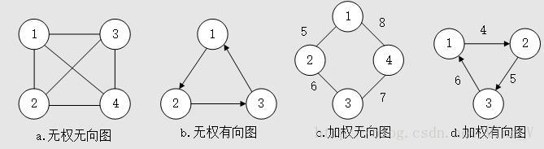
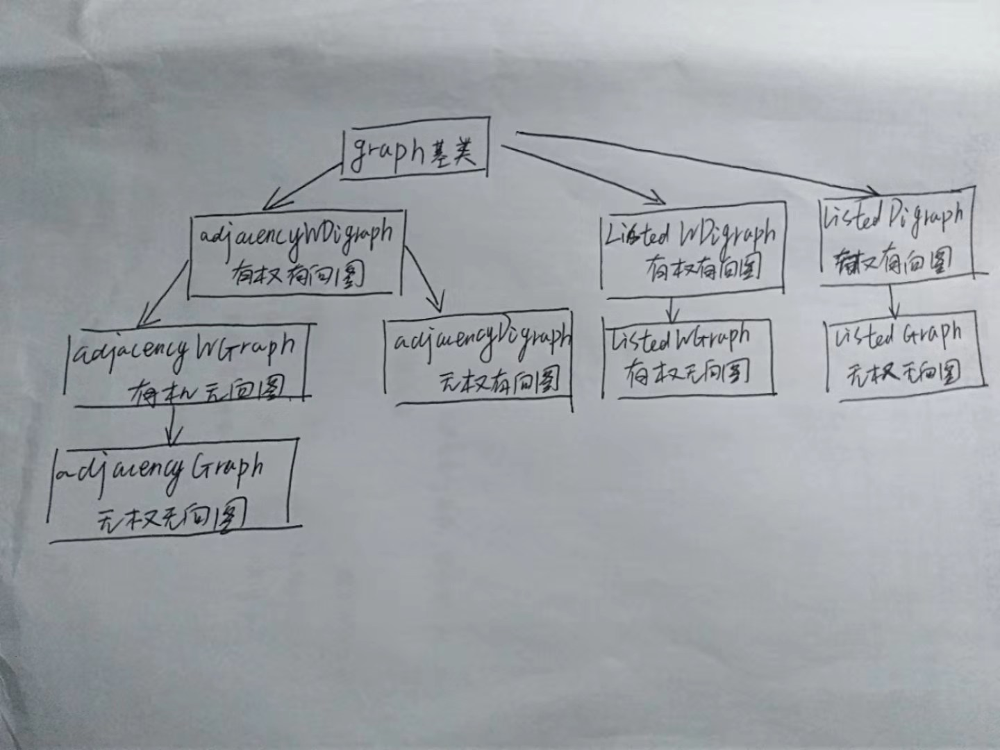

## 1、图
### 1.1、基本概念
* **图（graph）:** 是用线连接在一起的顶点或节点的集合，即两个要素：边和顶点。每一条边连
接个两个顶点，用（i，j）表示顶点为 i 和 j 的边。

* 有方向的边称为 **有向边**，对应的图成为 **有向图**，没有方向的边称为 **无向边**，
对应的图叫 **无向图**

* 对于无向图，边（i， j）和（j，i）是一样的，称顶点 i 和 j 是邻接的，边（i，j）
**关联于** 顶点 i 和 j ；对于有向图，边（i，j）表示由顶点 i 指向顶点 j 的边，
即称顶点 i **邻接至**顶点 j ，顶点 i **邻接于**顶点 j ，边（i，j）关联至顶点 j
而关联于顶点 i 。

* 对于很多的实际问题，不同顶点之间的边的权值（长度、重量、成本、价值等实际意义）是不一
样的，所以这样的图被称为 **加权图**，反之边没有权值的图称为 **无权图**。所以，
图分为四种：**加权有向图**，**加权无向图**，**无权有向图**，**无权无向图**。

### 2、图的实现
对于4种图加权有向图，加权无向图，无权有向图，无权无向图，需要同时考虑邻接矩阵和
链表的实现方法，所以共有8种情况。

对于这8种情况存在isA关系，如：对于邻接矩阵的实现，无向图可以看做（i,j）和（j,i）都存在
有向图；也可以看作权为1的加权无向图；也可以看作权为1，（i,j）和（j,i）都存在加权有向图
（IsA：父类可以被子类初始化，但是子类不可以被父类初始化）

所以上述8中类的继承关系如下：

### 2.3、图的遍历
#### 1. 广度优先搜索（BFS）

**从一个顶点开始搜索所有可能到达顶点的方法**,这种搜索方法可以使用队列实现。

**【思想】**

从图中某顶点v出发，在访问了v之后依次访问v的各个未曾访问过的邻接点，然后分别从这些
邻接点出发依次访问它们的邻接点，并使得“先被访问的顶点的邻接点先于后被访问的顶点的邻接点被
访问，直至图中所有已被访问的顶点的邻接点都被访问到。如果此时图中尚有顶点未被访问，则需要另
选一个未曾被访问过的顶点作为新的起始点，重复上述过程，直至图中所有顶点都被访问到为止。
换句话说，广度优先搜索遍历图的过程是以v为起点，由近至远，依次访问和v有路径相通且路径长度
为1,2...的顶点。

* **图解**
1) 无向图的广度优先搜索:

**第1步：** 访问A。

**第2步：** 依次访问C,D,F。在访问了A之后，接下来访问A的邻接点。前面已经说过，在本文实
现中，顶点ABCDEFG按照顺序存储的，C在"D和F"的前面，因此，先访问C。再访问完C之后，再依次
访问D,F。

**第3步：** 依次访问B,G。在第2步访问完C,D,F之后，再依次访问它们的邻接点。首先访问C的
邻接点B，再访问F的邻接点G。

**第4步：** 访问E。在第3步访问完B,G之后，再依次访问它们的邻接点。只有G有邻接点E，因此
访问G的邻接点E。

因此访问顺序是：A -> C -> D -> F -> B -> G -> E

2) 有向图的广度优先搜索

**第1步：** 访问A。

**第2步：** 访问B。

**第3步：** 依次访问C,E,F。在访问了B之后，接下来访问B的出边的另一个顶点，即C,E,F。前
面已经说过，在本文实现中，顶点ABCDEFG按照顺序存储的，因此会先访问C，再依次访问E,F。

**第4步：** 依次访问D,G。在访问完C,E,F之后，再依次访问它们的出边的另一个顶点。还是按
照C,E,F的顺序访问，C的已经全部访问过了，那么就只剩下E,F；先访问E的邻接点D，再访问F的邻
接点G。

因此访问顺序是：A -> B -> C -> E -> F -> D -> G

> **参考链接：** [图的遍历之 深度优先搜索和广度优先搜索](https://www.cnblogs.com/skywang12345/p/3711483.html#anchor2)
