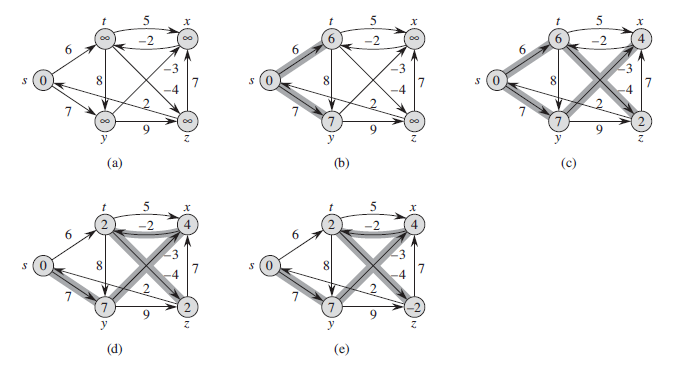
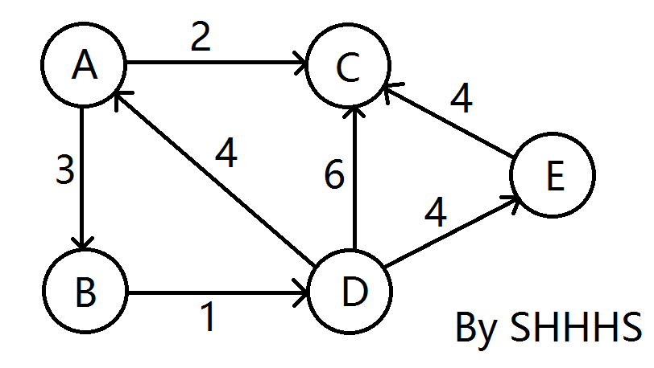
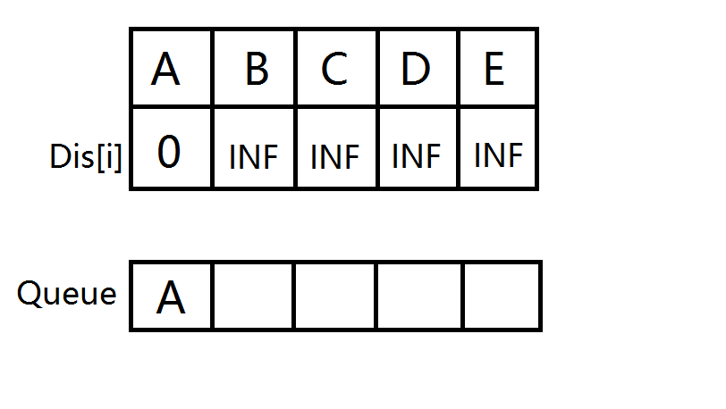
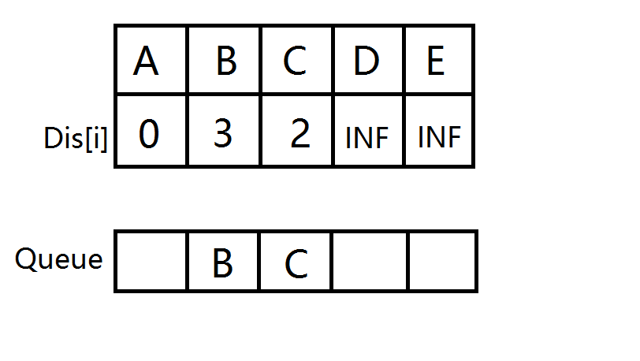
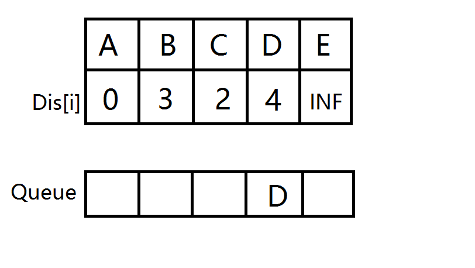
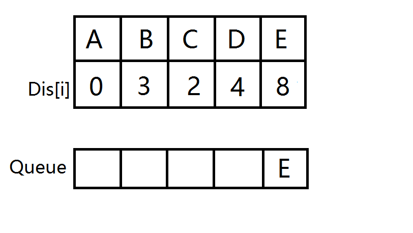
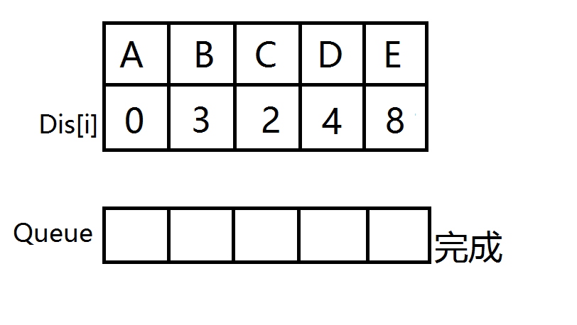
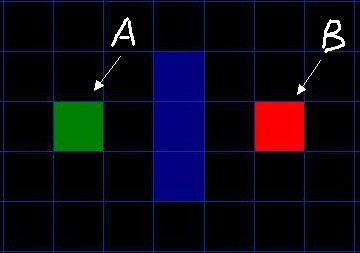

## 1、图
### 1.1、基本概念
* **图（graph）:** 是用线连接在一起的顶点或节点的集合，即两个要素：边和顶点。每一条边连
接个两个顶点，用（i，j）表示顶点为 i 和 j 的边。

* 有方向的边称为 **有向边**，对应的图成为 **有向图**，没有方向的边称为 **无向边**，
对应的图叫 **无向图**

* 对于无向图，边（i， j）和（j，i）是一样的，称顶点 i 和 j 是邻接的，边（i，j）
**关联于** 顶点 i 和 j ；对于有向图，边（i，j）表示由顶点 i 指向顶点 j 的边，
即称顶点 i **邻接至**顶点 j ，顶点 i **邻接于**顶点 j ，边（i，j）关联至顶点 j
而关联于顶点 i 。

* 对于很多的实际问题，不同顶点之间的边的权值（长度、重量、成本、价值等实际意义）是不一
样的，所以这样的图被称为 **加权图**，反之边没有权值的图称为 **无权图**。所以，
图分为四种：**加权有向图**，**加权无向图**，**无权有向图**，**无权无向图**。

## 2、图的实现
对于4种图加权有向图，加权无向图，无权有向图，无权无向图，需要同时考虑邻接矩阵和
链表的实现方法，所以共有8种情况。

对于这8种情况存在isA关系，如：对于邻接矩阵的实现，无向图可以看做（i,j）和（j,i）都存在
有向图；也可以看作权为1的加权无向图；也可以看作权为1，（i,j）和（j,i）都存在加权有向图
（IsA：父类可以被子类初始化，但是子类不可以被父类初始化）

所以上述8中类的继承关系如下：

## 3、图的遍历
### 3.1、 广度优先搜索（BFS）

**从一个顶点开始搜索所有可能到达顶点的方法**,这种搜索方法可以使用队列实现。

**【思想】**

从图中某顶点v出发，在访问了v之后依次访问v的各个未曾访问过的邻接点，然后分别从这些
邻接点出发依次访问它们的邻接点，并使得“先被访问的顶点的邻接点先于后被访问的顶点的邻接点被
访问，直至图中所有已被访问的顶点的邻接点都被访问到。如果此时图中尚有顶点未被访问，则需要另
选一个未曾被访问过的顶点作为新的起始点，重复上述过程，直至图中所有顶点都被访问到为止。
换句话说，广度优先搜索遍历图的过程是以v为起点，由近至远，依次访问和v有路径相通且路径长度
为1,2...的顶点。

**【图解】**
1) 无向图的广度优先搜索:

**第1步：** 访问A。

**第2步：** 依次访问C,D,F。在访问了A之后，接下来访问A的邻接点。前面已经说过，在本文实
现中，顶点ABCDEFG按照顺序存储的，C在"D和F"的前面，因此，先访问C。再访问完C之后，再依次
访问D,F。

**第3步：** 依次访问B,G。在第2步访问完C,D,F之后，再依次访问它们的邻接点。首先访问C的
邻接点B，再访问F的邻接点G。

**第4步：** 访问E。在第3步访问完B,G之后，再依次访问它们的邻接点。只有G有邻接点E，因此
访问G的邻接点E。

因此访问顺序是：A -> C -> D -> F -> B -> G -> E

2) 有向图的广度优先搜索

**第1步：** 访问A。

**第2步：** 访问B。

**第3步：** 依次访问C,E,F。在访问了B之后，接下来访问B的出边的另一个顶点，即C,E,F。前
面已经说过，在本文实现中，顶点ABCDEFG按照顺序存储的，因此会先访问C，再依次访问E,F。

**第4步：** 依次访问D,G。在访问完C,E,F之后，再依次访问它们的出边的另一个顶点。还是按
照C,E,F的顺序访问，C的已经全部访问过了，那么就只剩下E,F；先访问E的邻接点D，再访问F的邻
接点G。

因此访问顺序是：A -> B -> C -> E -> F -> D -> G

### 3.2、深度优先搜索（DFS）

**【思想】**

假设初始状态是图中所有顶点均未被访问，则从某个顶点v出发，首先访问该顶点，然后依次从它的各个未被访问的邻接点出发深度优先搜索遍历图，直至图中所有
和v有路径相通的顶点都被访问到。 若此时尚有其他顶点未被访问到，则另选一个未被访问的顶点作起始点，重复上述过程，直至图中所有顶点都被访问到为止。 
显然，深度优先搜索是一个递归的过程。

**【图解】**
1) 无向图的深度优先搜索:

**第1步：** 访问A。 

**第2步：** 访问(A的邻接点)C。在第1步访问A之后，接下来应该访问的是A的邻接点，即"C,D,F"中的一个。但在本文的实现中，顶点ABCDEFG是按照顺序存储，
C在"D和F"的前面，因此，先访问C。 

**第3步：** 访问(C的邻接点)B。在第2步访问C之后，接下来应该访问C的邻接点，即"B和D"中一个(A已经被访问过，就不算在内)。而由于B在D之前，先访问B。 

**第4步：** 访问(C的邻接点)D。在第3步访问了C的邻接点B之后，B没有未被访问的邻接点；因此，返回到访问C的另一个邻接点D。 

**第5步：** 访问(A的邻接点)F。前面已经访问了A，并且访问完了"A的邻接点B的所有邻接点(包括递归的邻接点在内)"；因此，此时返回到访问A的另一个邻接点F。 

**第6步：** 访问(F的邻接点)G。 

**第7步：** 访问(G的邻接点)E。 

因此访问顺序是：A -> C -> B -> D -> F -> G -> E

2) 有向图的深度优先搜索

**第1步：** 访问A。
 
**第2步：** 访问B。在访问了A之后，接下来应该访问的是A的出边的另一个顶点，即顶点B。 

**第3步：** 访问C。在访问了B之后，接下来应该访问的是B的出边的另一个顶点，即顶点C,E,F。在本文实现的图中，顶点ABCDEFG按照顺序存储，因此先访问C。 

**第4步：** 访问E。接下来访问C的出边的另一个顶点，即顶点E。 

**第5步：** 访问D。接下来访问E的出边的另一个顶点，即顶点B,D。顶点B已经被访问过，因此访问顶点D。 

**第6步：** 访问F。接下应该回溯"访问A的出边的另一个顶点F"。 

**第7步：** 访问G。

因此访问顺序是：A -> B -> C -> E -> D -> F -> G

> **参考链接：** [图的遍历之 深度优先搜索和广度优先搜索](https://www.cnblogs.com/skywang12345/p/3711483.html#anchor2)

## 4、最优路径

### 4.1、Dijkstra算法
迪杰斯特拉(Dijkstra)算法是单源最短路径算法，是基于贪心思想实现的，用于计算一个节点到其他节点的最短路径。 
它的主要特点是以起始点为中心向外层层扩展(广度优先搜索思想)，直到扩展到终点为止注意该算法要求图中不存在负权边。

**【思想】**

首先把起点到所有点的距离存下来找个最短的，然后松弛一次再找出最短的，所谓的松弛操作就是，遍历一遍看通过刚刚找到的距离最短的点作为中转站会不会更
近，如果更近了就更新距离，这样把所有的点找遍之后就存下了起点到其他所有点的最短距离。

**【图解】**

**a.** 初始时，S只包含源点，即S＝{v}，v的距离为0。U包含除v外的其他顶点，即:U={其余顶点}，若v与U中顶点u有边，则<u,v>正常有权值，若u不是v的
出边邻接点，则<u,v>权值为∞。

**b.** 从U中选取一个距离v最小的顶点k，把k，加入S中（该选定的距离就是v到k的最短路径长度）。

**c.** 以k为新考虑的中间点，修改U中各顶点的距离；若从源点v到顶点u的距离（经过顶点k）比原来距离（不经过顶点k）短，则修改顶点u的距离值，修改后
的距离值的顶点k的距离加上边上的权。

**d.** 重复步骤b和c直到所有顶点都包含在S中。

> **参考链接：** 

[最短路径—Dijkstra算法和Floyd算法](https://www.cnblogs.com/kex1n/p/4178782.html)

[数据结构--Dijkstra算法最清楚的讲解](https://blog.csdn.net/heroacool/article/details/51014824)

[Dijkstra算法图文详解](https://blog.csdn.net/lbperfect123/article/details/84281300)

### 4.2、Bellman-Ford算法

也叫贝尔曼-福特算法，它的原理是对图进行V-1次松弛操作，得到所有可能的最短路径。其优于
Dijkstra算法的方面是边的权值可以为负数、实现简单，缺点是时间复杂度过高，高达O(VE)。

Bellman-Ford 算法和 Dijkstra 算法同为解决单源最短路径的算法。对于带权有向图
G = (V, E)，Dijkstra 算法要求图 G 中边的权值均为非负，而 Bellman-Ford 算法能适应
一般的情况（即存在负权边的情况）。一个实现的很好的 Dijkstra 算法比 Bellman-Ford 算法
的运行时间要低。

Bellman-Ford 算法采用动态规划（Dynamic Programming）进行设计，实现的时间复杂度为
O(V*E)，其中 V 为顶点数量，E 为边的数量。Dijkstra 算法采用贪心算法（Greedy Algorithm）
范式进行设计，普通实现的时间复杂度为 O(V2)，若基于 Fibonacci heap 的最小优先队列实现
版本则时间复杂度为 O(E + VlogV)。

**【思想】**

为连续进行松弛，在每次松弛时把每条边都更新一下，若在n-1次松弛后还能更新，则说明图中有负
环，因此无法得出结果，否则就完成。

**【图解】**

**a.** 创建源顶点 v 到图中所有顶点的距离的集合 distSet，为图中的所有顶点指定一个距离
值，初始均为 Infinite，源顶点距离为 0；

**b.** 计算最短路径，执行 V - 1 次遍历；对于图中的每条边：如果起点 u 的距离 d 加上边
的权值 w 小于终点 v 的距离 d，则更新终点 v 的距离值 d；

**c.** 检测图中是否有负权边形成了环，遍历图中的所有边，计算 u 至 v 的距离，如果对于 v
存在更小的距离，则说明存在环；

> **参考链接：**

[Bellman-Ford 单源最短路径算法](https://www.cnblogs.com/gaochundong/p/bellman_ford_algorithm.html)

[深入理解Bellman-Ford（SPFA）算法](https://blog.csdn.net/u011893609/article/details/81232124)

### 4.3、SPFA算法
求单源最短路的SPFA算法的全称是：Shortest Path Faster Algorithm。 很多时候，给定的
图存在负权边，这时类似Dijkstra等算法便没有了用武之地，而Bellman-Ford算法的复杂度又过
高，SPFA算法便派上用场了。有人称spfa算法是最短路的万能算法。在Bellman-ford算法的
基础上加上一个队列优化，减少了冗余的松弛操作，是一种高效的最短路算法。

**【思想】**

设立一个先进先出的队列用来保存待优化的结点，优化时每次取出队首结点u，并且用u点当前的最短
路径估计值对离开u点所指向的结点v进行松弛操作，如果v点的最短路径估计值有所调整，且v点不在
当前的队列中，就将v点放入队尾。这样不断从队列中取出结点来进行松弛操作，直至队列空为止

在执行算法的时候，要判断图是否带有负环，方法有两种：
* 开始算法前，调用拓扑排序进行判断（一般不采用，浪费时间）
* 如果某个点进入队列的次数超过N次则存在负环（N为图的顶点数）

**【图解】**

* **源点A首先入队，并且AB松弛**

* **扩展与A相连的边，B，C 入队并松弛。**

* **B，C分别开始扩展，D入队并松弛**

* **D出队，E入队并松弛。**

* **E出队，此时队列为空，源点到所有点的最短路已被找到，A->E的最短路即为8**

> **参考链接：**

[SPFA算法](https://blog.csdn.net/qq_40061421/article/details/82054784)

[SPFA算法](https://www.cnblogs.com/shadowland/p/5870640.html)

### 4.4、Floyd-Warshall算法
Floyd-Warshall算法Floyd算法（弗洛伊德算法）是解决任意两点间的最短路径的一种算法，可以正确处理有向图或负权的最短
路径问题，同时也被用于计算有向图的传递闭包。Floyd-Warshall算法的时间复杂度为O(N3)，
空间复杂度为O(N2)。

**【思想】**

Floyd算法是一个经典的动态规划算法。用通俗的语言来描述的话，首先我们的目标是寻找从点i到
点j的最短路径。从动态规划的角度看问题，我们需要为这个目标重新做一个诠释（这个诠释正是动
态规划最富创造力的精华所在）

从任意节点i到任意节点j的最短路径不外乎2种可能，1是直接从i到j，2是从i经过若干个节点k到j。
所以，我们假设Dis(i,j)为节点u到节点v的最短路径的距离，对于每一个节点k，我们检查
Dis(i,k) + Dis(k,j) < Dis(i,j)是否成立，如果成立，证明从i到k再到j的路径比i直接到j
的路径短，我们便设置Dis(i,j) = Dis(i,k) + Dis(k,j)，这样一来，当我们遍历完所有节
点k，Dis(i,j)中记录的便是i到j的最短路径的距离。

> **参考链接：**

[最短路径Floyd算法【图文详解】](https://www.cnblogs.com/ECJTUACM-873284962/p/6995648.html)

### 4.5、A*算法

**【思想】**

起点不停的向周围总代价（总代价=实际代价+估计代价；实际代价=起点到该点最小代价；
估计代价=该点到终点的在理想代价，相当于没有障碍物的，有各种函数，我们自己选择）最小的格子
不停扩张，每个格子都会记住前一个格子，前一个格子一般它周围总代价最小的可以使用的（当然不
包括障碍物）格子，直到扩散的目标节点

**【图解】**

**1.** 从起点A开始, 把它作为待处理的方格存入一个"开启列表", 开启列表就是一个等待检查方格的列表.

**2.** 寻找起点A周围可以到达的方格, 将它们放入"开启列表", 并设置它们的"父方格"为A.

**3.** 从"开启列表"中删除起点 A, 并将起点 A 加入"关闭列表", "关闭列表"中存放的都是不需要再次检查的方格

图中浅绿色描边的方块表示已经加入 "开启列表" 等待检查. 淡蓝色描边的起点 A 表示已经放入
"关闭列表" , 它不需要再执行检查.从 "开启列表" 中找出相对最靠谱的方块, 什么是最靠谱?
它们通过公式 F=G+H 来计算.

**F = G + H**

G 表示从起点 A 移动到网格上指定方格的移动耗费 (可沿斜方向移动).H 表示从指定的方格移动到
终点 B 的预计耗费 (H 有很多计算方法, 这里我们设定只可以上下左右移动).

我们假设横向移动一个格子的耗费为10, 为了便于计算, 沿斜方向移动一个格子耗费是14. 为了更
直观的展示如何运算 FGH, 图中方块的左上角数字表示 F, 左下角表示 G, 右下角表示 H. 看看
是否跟你心里想的结果一样?从 "开启列表" 中选择 F 值最低的方格 C (绿色起始方块 A 右边的
方块), 然后对它进行如下处理:

**4.** 把它从 "开启列表" 中删除, 并放到 "关闭列表" 中.

**5.** 检查它所有相邻并且可以到达 (障碍物和 "关闭列表" 的方格都不考虑) 的方格. 如果这
些方格还不在 "开启列表" 里的话, 将它们加入 "开启列表", 计算这些方格的 G, H 和 F 值各
是多少, 并设置它们的 "父方格" 为 C.

**6.** 如果某个相邻方格 D 已经在 "开启列表" 里了, 检查如果用新的路径 (就是经过C 的路
径) 到达它的话, G值是否会更低一些, 如果新的G值更低, 那就把它的 "父方格" 改为目前选中的
方格 C, 然后重新计算它的 F 值和 G 值 (H 值不需要重新计算, 因为对于每个方块, H 值是不
变的). 如果新的 G 值比较高, 就说明经过 C 再到达 D 不是一个明智的选择, 因为它需要更远的
路, 这时我们什么也不做.

> **参考链接：**

[A* 寻路算法 ](http://www.cppblog.com/christanxw/archive/2006/04/07/5126.html)

[A*算法（附c源码）](https://www.cnblogs.com/mingbujian/p/4915546.html)

[A*寻路算法C++简单实现](https://blog.csdn.net/u012234115/article/details/47152137)

