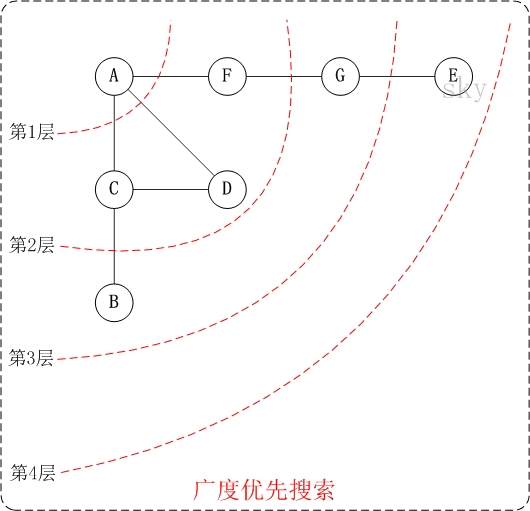
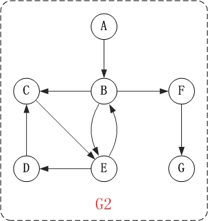
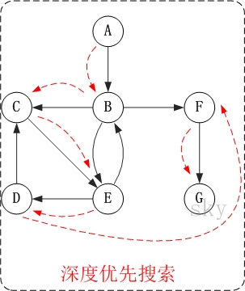

## 1、图
### 1.1、基本概念
* **图（graph）:** 是用线连接在一起的顶点或节点的集合，即两个要素：边和顶点。每一条边连
接个两个顶点，用（i，j）表示顶点为 i 和 j 的边。

* 有方向的边称为 **有向边**，对应的图成为 **有向图**，没有方向的边称为 **无向边**，
对应的图叫 **无向图**

* 对于无向图，边（i， j）和（j，i）是一样的，称顶点 i 和 j 是邻接的，边（i，j）
**关联于** 顶点 i 和 j ；对于有向图，边（i，j）表示由顶点 i 指向顶点 j 的边，
即称顶点 i **邻接至**顶点 j ，顶点 i **邻接于**顶点 j ，边（i，j）关联至顶点 j
而关联于顶点 i 。

* 对于很多的实际问题，不同顶点之间的边的权值（长度、重量、成本、价值等实际意义）是不一
样的，所以这样的图被称为 **加权图**，反之边没有权值的图称为 **无权图**。所以，
图分为四种：**加权有向图**，**加权无向图**，**无权有向图**，**无权无向图**。

## 2、图的实现
对于4种图加权有向图，加权无向图，无权有向图，无权无向图，需要同时考虑邻接矩阵和
链表的实现方法，所以共有8种情况。

对于这8种情况存在isA关系，如：对于邻接矩阵的实现，无向图可以看做（i,j）和（j,i）都存在
有向图；也可以看作权为1的加权无向图；也可以看作权为1，（i,j）和（j,i）都存在加权有向图
（IsA：父类可以被子类初始化，但是子类不可以被父类初始化）

所以上述8中类的继承关系如下：

## 3、图的遍历
### 3.1、 广度优先搜索（BFS）

**从一个顶点开始搜索所有可能到达顶点的方法**,这种搜索方法可以使用队列实现。

**【思想】**

从图中某顶点v出发，在访问了v之后依次访问v的各个未曾访问过的邻接点，然后分别从这些
邻接点出发依次访问它们的邻接点，并使得“先被访问的顶点的邻接点先于后被访问的顶点的邻接点被
访问，直至图中所有已被访问的顶点的邻接点都被访问到。如果此时图中尚有顶点未被访问，则需要另
选一个未曾被访问过的顶点作为新的起始点，重复上述过程，直至图中所有顶点都被访问到为止。
换句话说，广度优先搜索遍历图的过程是以v为起点，由近至远，依次访问和v有路径相通且路径长度
为1,2...的顶点。

**【图解】**
1) 无向图的广度优先搜索:

**第1步：** 访问A。

**第2步：** 依次访问C,D,F。在访问了A之后，接下来访问A的邻接点。前面已经说过，在本文实
现中，顶点ABCDEFG按照顺序存储的，C在"D和F"的前面，因此，先访问C。再访问完C之后，再依次
访问D,F。

**第3步：** 依次访问B,G。在第2步访问完C,D,F之后，再依次访问它们的邻接点。首先访问C的
邻接点B，再访问F的邻接点G。

**第4步：** 访问E。在第3步访问完B,G之后，再依次访问它们的邻接点。只有G有邻接点E，因此
访问G的邻接点E。

因此访问顺序是：A -> C -> D -> F -> B -> G -> E

2) 有向图的广度优先搜索

**第1步：** 访问A。

**第2步：** 访问B。

**第3步：** 依次访问C,E,F。在访问了B之后，接下来访问B的出边的另一个顶点，即C,E,F。前
面已经说过，在本文实现中，顶点ABCDEFG按照顺序存储的，因此会先访问C，再依次访问E,F。

**第4步：** 依次访问D,G。在访问完C,E,F之后，再依次访问它们的出边的另一个顶点。还是按
照C,E,F的顺序访问，C的已经全部访问过了，那么就只剩下E,F；先访问E的邻接点D，再访问F的邻
接点G。

因此访问顺序是：A -> B -> C -> E -> F -> D -> G

### 3.2、深度优先搜索（DFS）

**【思想】**

假设初始状态是图中所有顶点均未被访问，则从某个顶点v出发，首先访问该顶点，然后依次从它的各个未被访问的邻接点出发深度优先搜索遍历图，直至图中所有
和v有路径相通的顶点都被访问到。 若此时尚有其他顶点未被访问到，则另选一个未被访问的顶点作起始点，重复上述过程，直至图中所有顶点都被访问到为止。 
显然，深度优先搜索是一个递归的过程。

**【图解】**
1) 无向图的深度优先搜索:

**第1步：** 访问A。 

**第2步：** 访问(A的邻接点)C。在第1步访问A之后，接下来应该访问的是A的邻接点，即"C,D,F"中的一个。但在本文的实现中，顶点ABCDEFG是按照顺序存储，
C在"D和F"的前面，因此，先访问C。 

**第3步：** 访问(C的邻接点)B。在第2步访问C之后，接下来应该访问C的邻接点，即"B和D"中一个(A已经被访问过，就不算在内)。而由于B在D之前，先访问B。 

**第4步：** 访问(C的邻接点)D。在第3步访问了C的邻接点B之后，B没有未被访问的邻接点；因此，返回到访问C的另一个邻接点D。 

**第5步：** 访问(A的邻接点)F。前面已经访问了A，并且访问完了"A的邻接点B的所有邻接点(包括递归的邻接点在内)"；因此，此时返回到访问A的另一个邻接点F。 

**第6步：** 访问(F的邻接点)G。 

**第7步：** 访问(G的邻接点)E。 

因此访问顺序是：A -> C -> B -> D -> F -> G -> E

2) 有向图的深度优先搜索

**第1步：** 访问A。
 
**第2步：** 访问B。在访问了A之后，接下来应该访问的是A的出边的另一个顶点，即顶点B。 

**第3步：** 访问C。在访问了B之后，接下来应该访问的是B的出边的另一个顶点，即顶点C,E,F。在本文实现的图中，顶点ABCDEFG按照顺序存储，因此先访问C。 

**第4步：** 访问E。接下来访问C的出边的另一个顶点，即顶点E。 

**第5步：** 访问D。接下来访问E的出边的另一个顶点，即顶点B,D。顶点B已经被访问过，因此访问顶点D。 

**第6步：** 访问F。接下应该回溯"访问A的出边的另一个顶点F"。 

**第7步：** 访问G。

因此访问顺序是：A -> B -> C -> E -> D -> F -> G

> **参考链接：** [图的遍历之 深度优先搜索和广度优先搜索](https://www.cnblogs.com/skywang12345/p/3711483.html#anchor2)

## 4、最优路径

### 4.1、Dijkstra算法
迪杰斯特拉(Dijkstra)算法是单源最短路径算法，是基于贪心思想实现的，用于计算一个节点到其他节点的最短路径。 
它的主要特点是以起始点为中心向外层层扩展(广度优先搜索思想)，直到扩展到终点为止注意该算法要求图中不存在负权边。

**【思想】**

首先把起点到所有点的距离存下来找个最短的，然后松弛一次再找出最短的，所谓的松弛操作就是，遍历一遍看通过刚刚找到的距离最短的点作为中转站会不会更
近，如果更近了就更新距离，这样把所有的点找遍之后就存下了起点到其他所有点的最短距离。

**【图解】**

**a.** 初始时，S只包含源点，即S＝{v}，v的距离为0。U包含除v外的其他顶点，即:U={其余顶点}，若v与U中顶点u有边，则<u,v>正常有权值，若u不是v的
出边邻接点，则<u,v>权值为∞。

**b.** 从U中选取一个距离v最小的顶点k，把k，加入S中（该选定的距离就是v到k的最短路径长度）。

**c.** 以k为新考虑的中间点，修改U中各顶点的距离；若从源点v到顶点u的距离（经过顶点k）比原来距离（不经过顶点k）短，则修改顶点u的距离值，修改后
的距离值的顶点k的距离加上边上的权。

**d.** 重复步骤b和c直到所有顶点都包含在S中。

> **参考链接：** 

[最短路径—Dijkstra算法和Floyd算法](https://www.cnblogs.com/kex1n/p/4178782.html)

[数据结构--Dijkstra算法最清楚的讲解](https://blog.csdn.net/heroacool/article/details/51014824)

[Dijkstra算法图文详解](https://blog.csdn.net/lbperfect123/article/details/84281300)

### 4.2、A*算法

> **参考链接：**

[堪称最好的A*算法](https://blog.csdn.net/b2b160/article/details/4057781)
