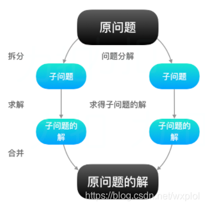
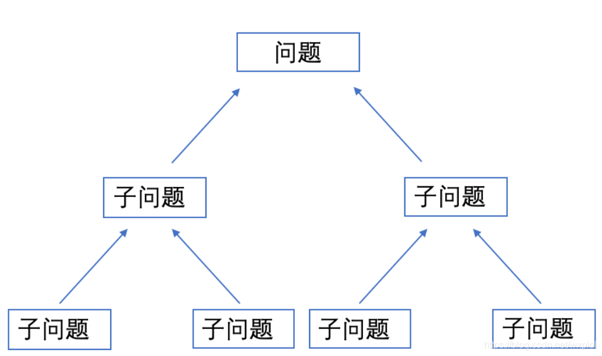

## 1、回溯法

**回溯法（back tracking)**（探索与回溯法）是一种选优搜索法，又称为试探法，按选优条件向前搜索，以达到目标。但当探索到某一步时，发现原先选择并不优或达不到目标，就退回一步重新选择，这种走不通就退回再走的技术为回溯法，而满足回溯条件的某个状态的点称为“回溯点”。

**解决一个回溯问题，实际上就是一个决策树的遍历过程**。你只需要思考 3 个问题：

1、路径：也就是已经做出的选择。

2、选择列表：也就是你当前可以做的选择。

3、结束条件：也就是到达决策树底层，无法再做选择的条件

回溯算法的基本框架：

```c++
result = []
def backtrack(路径, 选择列表):
    if 满足结束条件:
        result.add(路径)
        return
    
    for 选择 in 选择列表:
        做选择
        backtrack(路径, 选择列表)
        撤销选择
```

### 1.1、回溯法的实现-递归和迭代

**1.1.1、递归实现**

思路简单，设计容易，但效率低

```
int x[n];
void backtrack(int t)
{
    if(t>n)              //到达叶子节点，输出结果，x是可行解
        output(x);
    else
    {
        for i = 1 to k   //该节点的子节点（分量的所有下一个分量）
        {
            x[t] = value(i);    //取出子节点的值
            if(constraint(t) && bount(t) )    //剪枝函数：判断约束和界限
                backtrack(t+1);    //可以生成完全解，继续递归下去
        }
    }
}
```

**1.1.2、递推实现**

算法设计相对复杂，但效率高。

```
void backtrack()
{
    int t=1;
    while(t>0)
    {
        if(existSubNode(t))    //存在子节点：该结点还有可以构造的节点（下一个分量）
        {
            for i = 1 to k
            {
                x[t] = value(i);    //相当于在此处建立一个结点
                if(constraint(t) && bount(t) )    //剪枝函数判断约束和界限
                {
                    if(isResult(t) )    //得到了一个结果，输出
                        output(x);
                    else                //还没有得到结果，继续向下搜索
                        t++;
                }
                else
                {
                    eraseSubNode(t) //该结点无法构成完全解，故删去该结点,并设该结点不可再作为子节点。
                }
            }
        }
        else
        {
            eraseSubNode(t);    //该结点没有子结点，也不能完全解，所以删去该结点。
            t--;                //进行回溯
        }
    }
}
```

> **参考链接：**
>
>[[回溯算法] 五大常用算法之回溯法](https://blog.csdn.net/weiyuefei/article/details/79316653)
>
>[浅谈回溯算法](https://www.cnblogs.com/ladawn/p/8472733.html)

### 1.2、回溯法的经典问题

**1.2.1、0/1背包问题**

**问题：** 给定n种物品和一背包。物品i的重量是wi，其价值为pi，背包的容量为C。问应如何选
择装入背包的物品，使得装入背包中物品的总价值最大?

**分析：** 问题是n个物品中选择部分物品，可知，问题的解空间是子集树。比如物品数目n=3时，
其解空间树如下图，边为1代表选择该物品，边为0代表不选择该物品。使用x[i]表示物品i是否放入
背包，x[i]=0表示不放，x[i]=1表示放入。回溯搜索过程，如果来到了叶子节点，表示一条搜索路
径结束，如果该路径上存在更优的解，则保存下来。如果不是叶子节点，是中点的节点（如B），就
遍历其子节点（D和E），如果子节点满足剪枝条件，就继续回溯搜索子节点。


> **参考链接：**
>
>[【回溯法】－－01背包问题](https://blog.csdn.net/qian2213762498/article/details/79420269)

**1.2.2、n皇后问题**

**问题：** n 皇后问题研究的是如何将 n 个皇后放置在 n×n 的棋盘上，并且使皇后彼此之间不能相互攻击

PS：皇后可以攻击同一行、同一列、左上左下右上右下四个方向的任意单位。


**分析：** 这个问题本质上跟全排列问题差不多，决策树的每一层表示棋盘上的每一行；每个节点可以做出的选择是，在该行的任意一列放置一个皇后。

> **参考链接：**
>
>[回溯算法详解](https://github.com/kingqiuol/fucking-algorithm/blob/master/%E7%AE%97%E6%B3%95%E6%80%9D%E7%BB%B4%E7%B3%BB%E5%88%97/%E5%9B%9E%E6%BA%AF%E7%AE%97%E6%B3%95%E8%AF%A6%E8%A7%A3%E4%BF%AE%E8%AE%A2%E7%89%88.md)

## 2、分治法

在计算机科学中，分治法是构建基于多项分支递归的一种很重要的算法范式。字面上的解释是「分而治之」，就是把一个复杂的问题分成两个或更多的相同或相似的子问题，直到最后子问题可以简单的直接求解，原问题的解即子问题的解的合并。

这个技巧是很多高效算法的基础，如排序算法（快速排序、归并排序）、傅立叶变换（快速傅立叶变换）。



另一方面，理解及设计分治法算法的能力需要一定时间去掌握。正如以归纳法去证明一个理论，为了使递归能够推行，很多时候需要用一个较为概括或复杂的问题去取代原有问题。而且并没有一个系统性的方法去适当地概括问题。

分治法这个名称有时亦会用于将问题简化为只有一个细问题的算法，例如用于在已排序的列中查找其中一项的折半搜索算法。这些算法比一般的分治算法更能有效地运行。其中，假如算法使用尾部递归的话，便能转换成简单的循环。但在这广义之下，所有使用递归或循环的算法均被视作“分治算法”。因此，有些作者考虑“分治法”这个名称应只用于每个有最少两个子问题的算法。而只有一个子问题的曾被建议使用减治法这个名称。

分治算法通常以数学归纳法来验证。而它的计算成本则多数以解递归关系式来判定。

### 2.1、基本思想

**分治算法的主要思想是将原问题递归地分成若干个子问题，直到子问题满足边界条件，停止递归。将子问题逐个击破(一般是同种方法)，将已经解决的子问题合并，最后，算法会层层合并得到原问题的答案。**

### 2.2、解题思路

* 分：递归地将问题分解为各个的子问题(性质相同的、相互独立的子问题)；
* 治：将这些规模更小的子问题逐个击破；
* 合：将已解决的子问题逐层合并，最终得出原问题的解；



分治法的设计思想是：将一个难以直接解决的大问题，分割成一些规模较小的相同问题，以便各个击破，分而治之。

分治法适用的情况：

* 原问题的计算复杂度随着问题的规模的增加而增加。
* 原问题能够被分解成更小的子问题。
* 子问题的结构和性质与原问题一样，并且相互独立，子问题之间不包含公共的子子问题。
* 原问题分解出的子问题的解可以合并为该问题的解。

分治算法一般框架：
```python
def divide_conquer(problem, paraml, param2,...):
    # 不断切分的终止条件
    if problem is None:
        print_result
        return
    # 准备数据
    data=prepare_data(problem)
    # 将大问题拆分为小问题
    subproblems=split_problem(problem, data)
    # 处理小问题，得到子结果
    subresult1=self.divide_conquer(subproblems[0],p1,..…)
    subresult2=self.divide_conquer(subproblems[1],p1,...)
    subresult3=self.divide_conquer(subproblems[2],p1,.…)
    # 对子结果进行合并 得到最终结果
    result=process_result(subresult1, subresult2, subresult3,...)
```

### 2.3、分治法的经典问题

**2.3.1、利用分治算法求一组数据的逆序对个数**

**问题：** 设A[1..n]是一个包含n个不同整数的数组。如果在i<j的情况下，有A[i]>A[j]，则(i,j)就称为A中的一个逆序对（inversion）。
        给出一个算法，确定n个元素的任何排列中逆序对的书目。时间复杂度为o(nlgn)。

**分析：** 
* 分解：将数组A[1..n]分为两个子序列A[1..p]和A[p+1,n]，二分法将其分解。。

* 解决：根据归并排序的思想，在合并过程中，计算逆序对。假如两个子序列为X={4,5}和Y={2,3}，则XY的逆序对为X中元素大于Y中元素的数目。

* 合并：对两个子序列A[1..p]和A[p+1,n]合并后的序列求逆序对数目。

原数组的逆序对数目等于两个子序列逆序对数目之和再加上这两个子序列合并后的逆序对数目。

> **参考链接：**
>
>[分治法求逆序对数目](https://blog.csdn.net/u014082714/article/details/44681493)

## 3、动态规划法

###3.1、基本思想

**动态规划（英语：Dynamic programming，简称 DP）** 是一种在数学、管理科学、计算机科学、经济学和生物信息学中使用的，通过把原问题分解为相对简单的子问题的方式求解复杂问题的方法。

动态规划常常适用于有重叠子问题和最优子结构性质的问题，动态规划方法所耗时间往往远少于朴素解法。

动态规划背后的基本思想非常简单。大致上，若要解一个给定问题，我们需要解其不同部分（即子问题），再根据子问题的解以得出原问题的解。动态规划往往用于优化递归问题，例如斐波那契数列，如果运用递归的方式来求解会重复计算很多相同的子问题，利用动态规划的思想可以减少计算量。

通常许多子问题非常相似，为此动态规划法试图仅仅解决每个子问题一次，具有天然剪枝的功能，从而减少计算量：一旦某个给定子问题的解已经算出，则将其记忆化存储，以便下次需要同一个子问题解之时直接查表。这种做法在重复子问题的数目关于输入的规模呈指数增长时特别有用。

动态规划问题的一般形式就是求最值。动态规划其实是运筹学的一种最优化方法，只不过在计算机问题上应用比较多，比如说让你求最长递增子序列呀，最小编辑距离等等。求解动态规划的核心问题是穷举。因为要求最值，肯定要把所有可行的答案穷举出来，然后在其中找最值。

###3.2、解题思路

动态规划就这么简单，就是穷举就完事了？我看到的动态规划问题都很难啊！

首先，动态规划的穷举有点特别，因为这类问题存在「重叠子问题」，如果暴力穷举的话效率会极其低下，所以需要【备忘录】或者【DP table】来优化穷举过程，避免不必要的计算。

而且，动态规划问题一定会具备「最优子结构」，才能通过子问题的最值得到原问题的最值。

另外，虽然动态规划的核心思想就是穷举求最值，但是问题可以千变万化，穷举所有可行解其实并不是一件容易的事，只有列出正确的「状态转移方程」才能正确地穷举。

以上提到的重叠子问题、最优子结构、状态转移方程就是动态规划三要素。具体什么意思等会会举例详解，但是在实际的算法问题中，写出状态转移方程是最困难的，这也就是为什么很多朋友觉得动态规划问题困难的原因，我来提供我研究出来的一个思维框架，辅助你思考状态转移方程：

* 明确「状态」
* 定义 dp 数组/函数的含义
* 明确「选择」
* 明确 base case

动态规划模板步骤：

* 确定动态规划状态

* 写出状态转移方程（画出状态转移表）

* 考虑初始化条件

* 考虑输出状态

* 考虑对时间，空间复杂度的优化（Bonus）

### 3.3、动态规划的经典问题

**3.3.1、最小路径和（详细可看Minimum Path Sum）**

**问题：** 设A[1..n]是一个包含n个不同整数的数组。如果在i<j的情况下，有A[i]>A[j]，则(i,j)就称为A中的一个逆序对（inversion）。
        给出一个算法，确定n个元素的任何排列中逆序对的书目。时间复杂度为o(nlgn)。

**分析：** 
* 分解：将数组A[1..n]分为两个子序列A[1..p]和A[p+1,n]，二分法将其分解。。

* 解决：根据归并排序的思想，在合并过程中，计算逆序对。假如两个子序列为X={4,5}和Y={2,3}，则XY的逆序对为X中元素大于Y中元素的数目。

* 合并：对两个子序列A[1..p]和A[p+1,n]合并后的序列求逆序对数目。

原数组的逆序对数目等于两个子序列逆序对数目之和再加上这两个子序列合并后的逆序对数目。

**3.3.2、编程实现莱文斯坦最短编辑距离**

**问题：** 
给你两个单词 word1 和 word2，请你计算出将 word1 转换成 word2 所使用的最少操作数 。你可以对一个单词进行如下三种操作：

>插入一个字符
>
>删除一个字符
>
>替换一个字符

**分析：** 

**第一步：** 确定动态规划状态 这个题目涉及到两个字符串，所以我们最先想到就是用两维数组来保存转移状态，定义dp[i][j]为字符串word1长度为i和字符串word2长度为j时，word1转化成word2所执行的最少操作次数的值。

**第二步：** 写出状态转移方程 关于这个问题的状态转移方程其实很难想到，这里提供的一个方向就是试着举个例子，然后通过例子的变化记录每一步变化得到的最少次数，来找到删除，插入，替换操作的状态转移方程具体应该怎么写。 我们采用从末尾开始遍历word1和word2， 当word1[i]等于word2[j]时，说明两者完全一样，所以i和j指针可以任何操作都不做，用状态转移式子表示就是dp[i][j]=dp[i-1][j-1]，也就是前一个状态和当前状态是一样的。 当word1[i]和word2[j]不相等时，就需要对三个操作进行递归了，这里就需要仔细思考状态转移方程的写法了。 对于插入操作，当我们在word1中插入一个和word2一样的字符，那么word2就被匹配了，所以可以直接表示为dp[i][j-1]+1 对于删除操作，直接表示为dp[i-1][j]+1 对于替换操作，直接表示为dp[i-1][j-1]+1 所以状态转移方程可以写成min(dp[i][j-1]+1,dp[i-1][j]+1,dp[i-1][j-1]+1)​

**第三步：** 考虑初始化条件 我们还是利用dp转移表法来找到状态转移的变化（读者可以自行画一张dp表，具体方法在求最长子序列中已经演示过了），这里我们用空字符串来额外加入到word1和word2中，这样的目的是方便记录每一步操作，例如如果其中一个是空字符串，那么另外一个字符至少的操作数都是1，就从1开始计数操作数，以后每一步都执行插入操作，也就是当i=0时，dp[0][j]=j,同理可得，如果另外一个是空字符串，则对当前字符串执行删除操作就可以了，也就是dp[i][0]=i​。

**第四步：** 考虑输出状态 在转移表中我们可以看到，可以从左上角一直遍历到左下角的值，所以最终的编辑距离就是最后一个状态的值，对应的就是dp[-1][-1]​。

**第五步：** 考虑对时间，空间复杂度的优化 和上题一样，这里由于dp[i][j]只和dp表中附近的三个状态（左边，右边和左上边）有关，所以同样可以进行压缩状态转移的空间存储，如果觉得有兴趣可以参考@Lyncien的解法,对于时间方面应该并没有可以优化的方法。

**3.3.3、编程实现查找两个字符串的最长公共子序列**

**问题：** 

给定两个字符串，求解这两个字符串的最长公共子序列（Longest Common Sequence）。比如字符串1：BDCABA；字符串2：ABCBDAB
        则这两个字符串的最长公共子序列长度为4，最长公共子序列是：BCBA  

**分析：** 

① 最优子结构

设 C[i,j] = |LCS(x[1...i],y[1...j])|，即C[i,j]表示序列X[1...i]和Y[1...j]的最长公共子序列的长度，则 C[m,n] = |LCS(x,y)|就是问题的解。

递归推导式：

```apple js
LCS(x,y,i,j)
if x[i] = y[j]
then C[i,j] ← LCS(x,y,i-1,j-1)+1
else C[i,j] ← max{LCS(x,y,i-1,j),LCS(x,y,i,j-1)}
return C[i,j]
```
从这个递归公式可以看出，问题具有最优子结构性质！

② 重叠子问题

根据上面的递归推导式，可以写出求LCS长度的递归伪代码：
```apple js
LCS(x,y,i,j)
if x[i] = y[j]
then C[i,j] ← LCS(x,y,i-1,j-1)+1
else C[i,j] ← max{LCS(x,y,i-1,j),LCS(x,y,i,j-1)}
return C[i,j]
```

**3.3.4、编程实现一个数据序列的最长递增子序列**

**问题：** 

给定一个未经排序的整数数组，找到最长且连续的的递增序列。

```apple js
        示例 1:
        输入: [1,3,5,4,7]
        输出: 3
        解释: 最长连续递增序列是 [1,3,5], 长度为3。
        尽管 [1,3,5,7] 也是升序的子序列, 但它不是连续的，因为5和7在原数组里被4隔开。 
```

**分析：** 

这道题是不是一眼看过去和上题非常的像，没错了，这个题目最大的不同就是连续两个字，这样就让这个问题简单很多了，因为如果要求连续的话，那么就不需要和上题一样遍历两遍数组，只需要比较前后的值是不是符合递增的关系。

第一步：确定动态规划状态 对于这个问题，我们的状态dp[i]也是以nums[i]这个数结尾的最长递增子序列的长度

第二步：写出状态转移方程 这个问题，我们需要分两种情况考虑，第一种情况是如果遍历到的数nums[i]后面一个数不是比他大或者前一个数不是比他小，也就是所谓的不是连续的递增，那么这个数列最长连续递增序列就是他本身，也就是长度为1。 第二种情况就是如果满足有递增序列，就意味着当前状态只和前一个状态有关，dp[i]只需要在前一个状态基础上加一就能得到当前最长连续递增序列的长度。总结起来，状态的转移方程可以写成 dp[i]=dp[i-1]+1

第三步：考虑初始化条件 和上面最长子序列相似，这个题目的初始化状态就是一个一维的全为1的数组。

第四步：考虑输出状态 与上题相似，这个问题输出条件也是求dp数组中最大的数。

第五步：考虑是否可以优化 这个题目只需要一次遍历就能求出连续的序列，所以在时间上已经没有可以优化的余地了，空间上来看的话也是一维数组，并没有优化余地。
