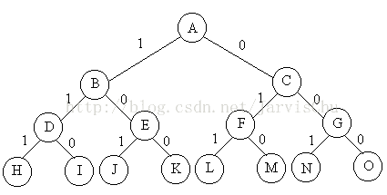

## 1、回溯法

**回溯法：** 搜索问题解的一种系统方法。

**【算法思想：】**

1）定义解空间：这个解空间至少包含问题的一个最优解

2）组织解空间：典型的组织方法有图或树

3）按照深度优先遍历的方法从根节点进行搜索，利用界定函数避免进入无解的子空间

首先从根节点出发搜索解空间树，当算法搜索至解空间树的某一节点时，先利用剪枝函
数判断该节点是否可行（即能得到问题的解）。如果不可行，则跳过对该节点为根的子
树的搜索，逐层向其祖先节点回溯；否则，进入该子树，继续按深度优先策略搜索。

搜索过程使用剪枝函数来为了避免无效的搜索。剪枝函数包括两类：1. 使用约束函数，
剪去不满足约束条件的路径；2.使用限界函数，剪去不能得到最优解的路径。

>**特性：** 在进行搜索的同时产生解空间，在搜索的任何时刻仅保留从开始节点到当前E节点的路径

### 1.1、回溯法的实现-递归和迭代

**1.1.1、递归实现**

思路简单，设计容易，但效率低

```
int x[n];
void backtrack(int t)
{
    if(t>n)              //到达叶子节点，输出结果，x是可行解
        output(x);
    else
    {
        for i = 1 to k   //该节点的子节点（分量的所有下一个分量）
        {
            x[t] = value(i);    //取出子节点的值
            if(constraint(t) && bount(t) )    //剪枝函数：判断约束和界限
                backtrack(t+1);    //可以生成完全解，继续递归下去
        }
    }
}
```

**1.1.2、递推实现**

算法设计相对复杂，但效率高。

```
void backtrack()
{
    int t=1;
    while(t>0)
    {
        if(existSubNode(t))    //存在子节点：该结点还有可以构造的节点（下一个分量）
        {
            for i = 1 to k
            {
                x[t] = value(i);    //相当于在此处建立一个结点
                if(constraint(t) && bount(t) )    //剪枝函数判断约束和界限
                {
                    if(isResult(t) )    //得到了一个结果，输出
                        output(x);
                    else                //还没有得到结果，继续向下搜索
                        t++;
                }
                else
                {
                    eraseSubNode(t) //该结点无法构成完全解，故删去该结点,并设该结点不可再作为子节点。
                }
            }
        }
        else
        {
            eraseSubNode(t);    //该结点没有子结点，也不能完全解，所以删去该结点。
            t--;                //进行回溯
        }
    }
}
```

> **参考链接：**
>
>[[回溯算法] 五大常用算法之回溯法](https://blog.csdn.net/weiyuefei/article/details/79316653)
>
>[浅谈回溯算法](https://www.cnblogs.com/ladawn/p/8472733.html)

### 1.2、回溯法的经典问题

**1.2.1、0/1背包问题**

**问题：** 给定n种物品和一背包。物品i的重量是wi，其价值为pi，背包的容量为C。问应如何选
择装入背包的物品，使得装入背包中物品的总价值最大?

**分析：** 问题是n个物品中选择部分物品，可知，问题的解空间是子集树。比如物品数目n=3时，
其解空间树如下图，边为1代表选择该物品，边为0代表不选择该物品。使用x[i]表示物品i是否放入
背包，x[i]=0表示不放，x[i]=1表示放入。回溯搜索过程，如果来到了叶子节点，表示一条搜索路
径结束，如果该路径上存在更优的解，则保存下来。如果不是叶子节点，是中点的节点（如B），就
遍历其子节点（D和E），如果子节点满足剪枝条件，就继续回溯搜索子节点。



> **参考链接：**
>
>[【回溯法】－－01背包问题](https://blog.csdn.net/qian2213762498/article/details/79420269)


